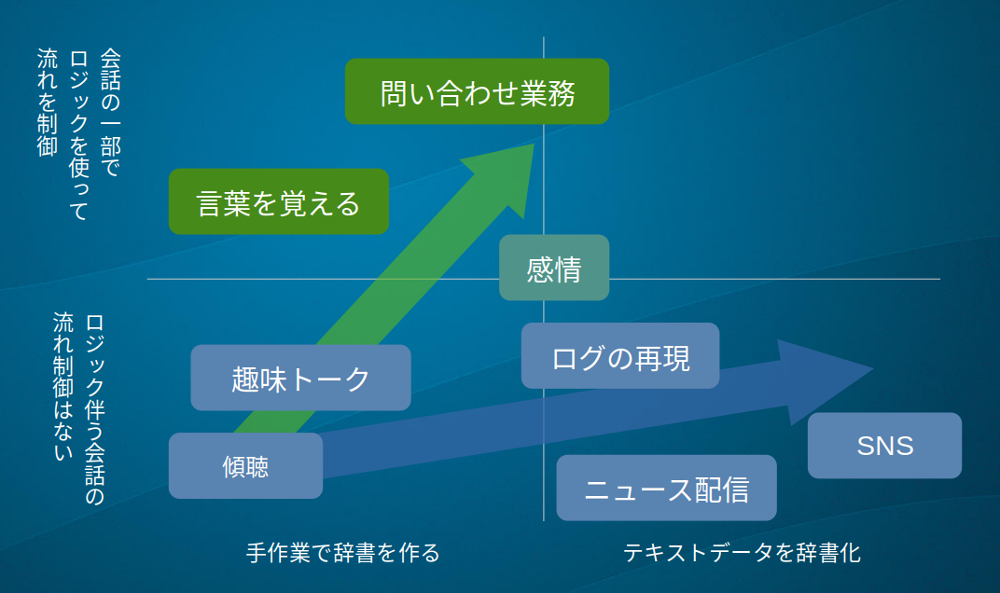

チャットボットは会話をする「ふり」をするプログラムです。  
「人間と会話をする」という目標は人工知能の研究が目指すゴールの一つでもあるのですが、きちんと意味を理解した上での会話の実現は今のところ相当先と言われています。
また会話といっても業務的な一問一答、世間話、会話を通じたカウンセリングなどその内容と難易度は多岐にわたり、いわゆる人工知能の技術だけではカバーできない要素がたくさんあります。
実はチャットボットのコンセプトを大きく特徴づける部分がこの「人工知能以外の部分」です。
つまりチャットボット研究は人工知能技術の成果を利用しつつ、人工知能の以外の何かとの組み合わせを模索する分野であると言えるかもしれません。
そんな人工知能研究とチャットボット研究の共通する部分と異なる部分を比べ、未来のチャットボットについて考えてみたいと思います。
 
人工知能研究にはこれまでに3つのブームがあったと言われています[^1]。

[^1]: [平成28年度 情報通信白書 人工知能（AI）の現状と未来](https://www.soumu.go.jp/johotsusintokei/whitepaper/ja/h28/pdf/n4200000.pdf)

## 第一次人工知能ブーム
最初は1950年代後半から1970年ごろまでの第一次人工知能ブームで、自然言語処理、ニューラルネットワーク、推論や探索といったパラダイムが発達しました。
現在注目されている統計的人工知能の基礎理論は、この時期に生まれています。
また記号論的人工知能の技術として推論や演繹操作を行うメカニズムなどが提案されて、一つの到達点としてユーザへの質問を繰り返して人工知能が持つ知識を元に正解を見つける「エキスパートシステム」が考案されました。
このシステムは医療診断などへの応用が期待されましたが、実際には現実の情報が複雑過ぎてうまくいかず、ブームは冬の時代に入りました。
エキスパートシステムはそのアルゴリズムを利用した[20Qというおもちゃのオンラインデモ](http://20q.net/)で現在も雰囲気を知ることができます。
 
最初期の代表的なチャットボットである**Eliza**は1966年にジョセフ・ワイゼンバウムによって発表されました[^2]。

[^2]:[J. Weizenbaum,"ELIZA A Computer Program For the Study of Natural Language Communication Between Man And Machine", *Comp. Linguistics* 9[1](1996)](https://dl.acm.org/doi/pdf/10.1145/365153.365168)

Elizaで行われていた自然言語処理は非常にシンプルなものでした。
一方でワイゼンバウムがこのチャットボットを「大まかにロジャー派のセラピストのように応答する」と述べているように、Elizaはユーザに質問し、ユーザ自身が自分の悩みに対する答えに気づくように導きました。
当時Elizaの反響は大きく、これをきっかけにその後も様々なチャットボットが作られています。

## 第二次人工知能ブーム

第二次人工知能ブームは1980年代から1990年代頃で、音声認識やデータマイニングなどの統計的人工知能の技術発達とともに、記号論的人工知能の分野では知識をデータとして表現する研究が活発になりました。
知識表現の一つの分野であるオントロジー工学では様々な概念の系統的な整理が研究されましたが、人工知能がオントロジーを自動生成したり、オントロジーを利用して世界を理解するという試みはうまく行きませんでした。
その原因はいくつかあり、**可能性爆発**や**記号接地問題**と呼ばれて今でも研究が続いています。
代わりにシンプルな言明だけを大量に集めて知識ベースを作るという試みもありましたが、大量の情報を集めることや体系化が困難であったために成功せず、第二次人工知能ブームは終わりました。

一方でElizaから続く「ソフトウェアを利用したカウンセリング」の研究は続いており[^3]、前述のワイゼンバウムが目指した来談者中心療法以外にも認知行動療法、系統的脱感作法、理性感情行動療法などを行う様々なシステムが提案されました。
しかしカウンセリングにチャットボットを利用した研究では大きな効果を認められませんでした。
その原因はチャットボットの会話にごく表面的で限られたレパートリーしかなく、相談者の状態を理解して対応する能力をチャットボットが持たなかったことだと考えられました。
Elizaなどのコンセプトは「人工知能技術と心理療法の組み合わせ」と言えます。組み合わせに価値があれば人工知能技術の部分が旧世代のものであっても十分に研究として有用になるのです。

[^3]: [H.Fujino, "Current situations and problems of software counselling" Proc. 2003 IEEE Intern. Sym. ](https://doi.org/10.1109/CIRA.2003.1222244)

### AIML
Artificial Intelligence Markup Language(AIML)はWallaceら[^4]とフリーウェア製作者たち1995〜2000年ごろに開発された、AIという名前がついていますがチャットボット記述用の言語です[^5]。

[^4]:[Richard S. Wallace, "The Elements of AIML Style" ALICE A. I. Foundation, Inc.(2003)](https://files.ifi.uzh.ch/cl/hess/classes/seminare/chatbots/style.pdf)
[^5]:[Bruno Marietto, et. al., "ARTIFICIAL INTELLIGENCE MARKUP LANGUAGE: A BRIEF TUTORIAL", *Intern. J. Computer Sci. and Eng. Survey* 4[3](2013)](https://arxiv.org/pdf/1307.3091.pdf)

AIMLはElizaのスクリプトをベースとしており、AIMLやその派生言語を利用したチャットボットは数多く作られて、現在では[A.I.Nexus](https://knytetrypper.proboards.com/)でそれらを見ることができます。
AIMLはチャットボットスクリプトの定式化と普及に貢献しましたが、それ自体は「人工知能以外の部分」を提案するものはありませんでした。

### 日本語版のチャットボット

1990年代には日本でもホビーとして様々なチャットボットが作られました。
自然言語としての日本語は英語と比べて複雑です。まず英語であれば単語がスペースで区切られており、主語＋動詞＋目的語のように語順が比較的決まっています。
日本語は単語の区切れも不明確で語順の融通も聞くため主語、述語、などを区別する前処理にも大きな計算資源が必要でした。
そのため当時はElizaよりもさらに簡易な方法として、辞書のキー文字列がユーザ発言に含まれるかどうか、という仕掛けの辞書を使うチャットボットが多数存在しました[^6]。
これらの日本語版のチャットボットの大きな成果は、雑談の会話モデルとしてチャットボットが知らないことをユーザが言った場合にどう返事をしたらよいか聞いて**言葉を覚える**というインタラクションを考案したこと、
そしてElizaの頃から用いられている一問一答形式に加えて**ログの再現**による会話を見出したことではないかと思います。
前者はユーザによる教育で会話しながらチャットボットが育つ感触をえられる点が優れていました。
後者は一つのチャットルームでの会話ログを辞書とし、会話の中でログのどこかの行に似た発言が見つかった場合その次の行を返答とする、という方法で、コミュニティと文脈に強く依存した返答を可能にしました。

[^6]: [加藤真一, 夢みるプログラム,ラトルズ (2016)](https://amzn.to/3yeHhsf)

この頃に作られた多くのチャットボットは海外、日本ともに「人工知能技術とコミュニケーションの組み合わせ」をコンセプトとしていたと言えるでしょう。
コミュニケーションとして「言葉を教える」「しりとりなどの言葉遊びをする」「趣味トークをする」などが試みられましたが、反応が単調にならないようにするには次第に巨大な辞書を必要とするようになりました。
この時期は辞書の全てを人力で作成していたため、チャットボット製作者の負担は非常に大きかったと思われます。

中でも実験的な取り組みとして画面上にアバターを表示するチャットボットであるペルソナウェア[(現Chararina)](https://www.praesens.co.jp/pws/)はニュースのプッシュ配信により会話レパートリーの維持を行いました。
この方法は現在のプッシュ式のニュース配信を先取りしたものでしたが、普及はなかなか進みませんでした。
ニュース配信には資金が必要になりますが、当時は現在のようなアプリ内広告が社会的に普及する前だったこともあって収益化は難航したのではないかと思われます。

## 第三次人工知能ブーム
2000年代後半頃から2022年現在も続く第三次人工知能ブームでは深層学習を始めとした統計的人工知能が発達しました。
またネットワークの普及が進んで容量が急激に増大したため画像、動画、テキストなどのデータを大量に入手・計算処理することが可能になり、自動運転や生産管理など社会実装が明確な形で進みはじめました。
自然言語処理においても統計的な手法が取り入れられました。その基本になったのがBag-of-wordsという考え方です。
これは一つの文に現れた単語を単語ごとに数え、その順序を無視して単語の出現数を成分としたベクトルに読み替えるものでした。
一方でBag-of-wordsでは数万次元のベクトルが作られますが、一つの文に現れる単語は多くて100程度なので、ベクトルのほとんどの成分は0になってしまうという問題がありました。
これを克服したのがword2vecです。Bag-of-wordsやword2vecによるテキストのベクトル化は深層学習との相性も良かったため大量のテキストデータを取り扱う道が開けました。
その結果、深層学習を利用した機械翻訳が登場して翻訳の精度が飛躍的に向上し、AIによる小説の自動生成のデモンストレーションなども行われました。
 
また2010年以降、チャットボットの商業化が本格化しました。
これは従来なかなか現れなかった「人工知能技術と問い合わせ業務の組み合わせ」で、質問に決まった答えを返すような業務を部分的に肩代わりする用途で用いられ、様々な製品が作られました。

# 人工知能技術とチャットボット

これまで見てきたように、人工知能には**統計的人工知能**と**記号的人工知能**という二種類の流れがあります。
最近流行りの統計的機械学習でチャットボットを構成したシンプルな例を一つ示します[^10]。 

[^10]:[Amila Viraj, "How To Build Your Own Chatbot Using Deep Learning”, medium (2020)](https://towardsdatascience.com/how-to-build-your-own-chatbot-using-deep-learning-bb41f970e281)

これは機械学習の基本的な用途の一つである「分類」で、辞書で与えた入力文字列を意図(intent)と呼ばれるコードのどれかに分類するという学習モデルを用意します。
得られたモデルにユーザからの入力を与えるとintentを予測します。intentが決まったら辞書を使って出力文字列を決めます。こうして一問一答形式のチャットボットを作ることができます。
マイクロソフトの開発したSNS上で反応するチャットボット「りんな」の初期バージョンでは上述のような方式をとっていました。
ところがこの方法は「会話の流れ」を考慮していないので、ユーザはすぐに飽きてしまいます。
 
次に統計的機械学習で利用されるようになったのはテキスト生成です。これは単語Xの次に現れる確率の高い単語Yを学習するという方式で、1900年代に作られたマルコフ連鎖という理論を基礎にしています。
マルコフ連鎖では「次の単語」を考慮するよりも「次の単語」「次の次の単語」のように範囲を広げたほうが自然な日本語が生成できます。
さらにマルコフ連鎖の考え方を単語から文に拡張することで柔軟かつ適切な返答を行うチャットボットが考案されました。これは前述のチャットボット「りんな」のバージョン２でも用いられました。

これらの統計的機械学習には数万行以上の大きなテキストデータが必要になります。
それを手作業で作ることが困難であるため、SNSなどに公開されているログを収集して学習させることになります。
このログは様々な立場の人間が様々な状況で発言したものの集まりなので、それらから作り出されたキャラクタに一つの統一された個性を読み取ることは難しいと考えられます。
 
チャットボットがより「生きている」と感じられるようにするため、ベイツは**感情**の組み込みが必要だと指摘しています[^11]。
ユーザのさまざまな入力文字列について喜怒哀楽のような感情を人間が読んでラベルを付与し、機械学習によってユーザ入力がどの感情に属する発言かを予測することができます。
それを利用し、Shinらはユーザの感情がポジティブならポジティブな反応を、ネガティブならネガティブな反応をするチャットボットを検討しました[^12]。
しかし、ユーザの感情は会話の流れの中で形作られるもので、恋人にやさしく囁かれた「ばか」と、嫌いな上司から憎々しげに言われた「ばか」とは明らかに別物です。
また同じ上司のセリフであっても、揉めているときの「（お前に任せた）**俺が馬鹿だった**」と、誤解が溶けた後の「（話を聞いてやれなかった）**俺が馬鹿だった**」は意図が逆になります。
Shinらの例では感情をポジティブ-ネガティブという一つの次元で示しました。それ以外にもっと複雑な感情の分類がいくつも考えられており、例えばMageedらはユーザの入力から得られる感情をPlutchikの輪に従って24に分類することを試みました[^13]。
彼らはGated Recurrent Neural Networkと呼ばれる手法を用いて、文脈に沿って高い精度でユーザの感情を細かく推測することに成功しています。
この方法ではテキストレベルで辞書や会話ログを模倣するだけでなく、感情状態のレベルで会話ログを模倣することに近づくでしょう。
しかし私達は同じ文脈だからといって、常に同じ感情になるわけではありません。 

ちなみに「相手が喜べばこちらも喜び、相手が悲しめばこちらも悲しむ」つまり**相手と同じ感情を表出する**という振る舞いは、幼い時期に自分の感情や意思を身近な大人から否定され続けた経験から自己の感情を持ってはならないという強い思い込みを無意識の中に持っている、いわゆる**毒親の影響下にある子供**の所見の一つです。
それをチャットボット製作者が意図的にデザインするのであれば非常に興味深いものになりますが、自分のチャットボットにはそんなふうに育ってほしくないと考える製作者は多いはずです。
つまり、特に雑談を目指すチャットボットでは統計的機械学習だけで感情を取り扱うのは製作者の意図せぬ結果につながる、ある意味大変筋の悪いことだと言えるでしょう。

[^11]:[J. Bates, "The role of emotion in believable agents", *Commun. ACM* 37[7] pp.122-125(1994)](https://dl.acm.org/doi/pdf/10.1145/176789.176803)
[^12]:[J. Shin et. al., "Generating Empathetic Responses by Looking Ahead The User’s Sentiment" ICASSP 2020](https://arxiv.org/pdf/1906.08487.pdf)
[^13]:[M. A. Mageed et. al., "EmoNet: Fine-Grained Emotion Detection with Gated Recurrent Neural Networks", *Proc. 55th Annual Meeting of the Assoc. for Computational Ling. pp.718-728(2017)](https://aclanthology.org/P17-1067.pdf)

## あすのチャットボット

チャットボットは「人工知能技術✕何か」をコンセプトにしています。それを念頭にこれまで紹介したチャットボットを整理すると以下のようになります。

1. 人工知能技術✕傾聴
2. 人工知能技術✕趣味トーク
3. 人工知能技術✕ログの再現
4. 人工知能技術✕ニュース配信
5. 人工知能技術✕SNS
6. 人工知能技術✕感情
7. 人工知能技術✕問い合わせ業務
8. 人工知能技術✕言葉を覚える

これらを「辞書の作り方」 vs 「会話にロジックを用いるかどうか」でプロットした図をFig. 1に示します。

1〜2は人工知能技術と組み合わせるコンセプトが具体的で、チャットの内容や方向性が明確です。そのためチャットボット開発者が辞書を作る労力が必要です。
3の「ログの再現」はきちんと会話になっているログを選ぶ必要はありますが、チャットの内容や方向性が明確なうえに辞書を手作りしなくてすむ特徴があります。
4「ニュース配信」の配信部分は当時は人工知能の要素があまりなかったようなのですが、現在改めて開発するのであれば統計的人工知能でのニュース感想など様々な展開が考えられそうな事例です。
5「SNS」は辞書のもととなるデータは雑多で大量なものを使い、その代わり統計的人工知能の部分の開発要素が強い例です。
ここまでは「ユーザに質問して答えに応じて動作を変える」といったロジックは特に用いられていません。
辞書の中にはロジックを感じさせるようなやり取りはあってもチャットボットとして何かロジックが組まれているわけではありません。
一方会話にロジックを利用しているチャットボットも存在します。
6の「感情」はその境界線上にあると言えるでしょう。上で紹介した感情の事例は統計的人工知能の工夫で感情を考慮したもので、確率論的に表現されたぼんやりしたロジックを持っています。
しかし、それは人間の感情のうち極めて表面的な部分に限られていて心理学的な見地からは非常に物足りないものです。
つまり、より心のモデルに立脚した感情のメカニズムを組み込むことも可能で、その場合はロジックを伴ったものになっても不思議はありません。
7の「問い合わせ業務」の場合は確率論的に答えられては困るので、「質問はXについてですか？Yについてですか？」「Xです。」「それでは…」のように明確なロジックを組み込むことが多くなります。
さらに8「言葉を覚える」では知らない言葉に出会った時、返事の仕方をユーザに聞いて覚えるというロジックが用いられます。
 
これらを俯瞰すると、チャットボットの開発には「テキストデータの辞書化」と「ロジックの組み込み」という２つの技術的ベクトルを見て取ることができます。
この２つは統計的人工知能と記号論的人工知能という潮流に対応したものかもしれません。
 
未来のチャットボットのコンセプトは第一に社会的ニーズや好奇心、面白さから生まれる「人工知能以外のなにか」を見つけ、次にそれを実現するために取り入れるべき人工知能技術を選ぶことで生み出すことができるのではないでしょうか。
本サイトのもう一つの章である「心をめぐる考察」では前者について様々な材料を集め検討することを目指します。
この章では後者の人工知能関連技術を吟味し、チャットボットの実装を考えていきます。
