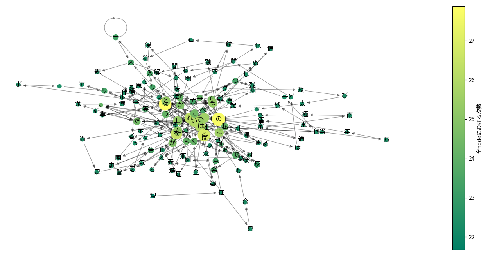
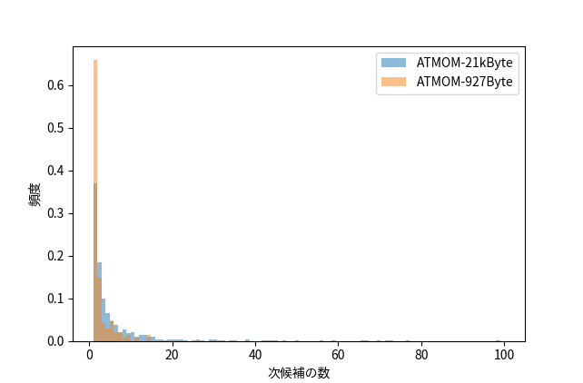
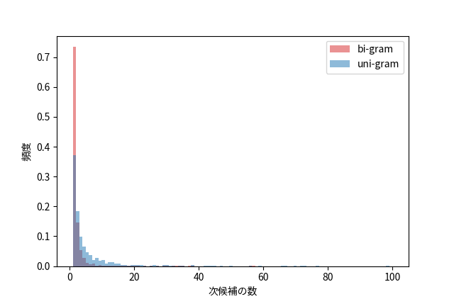
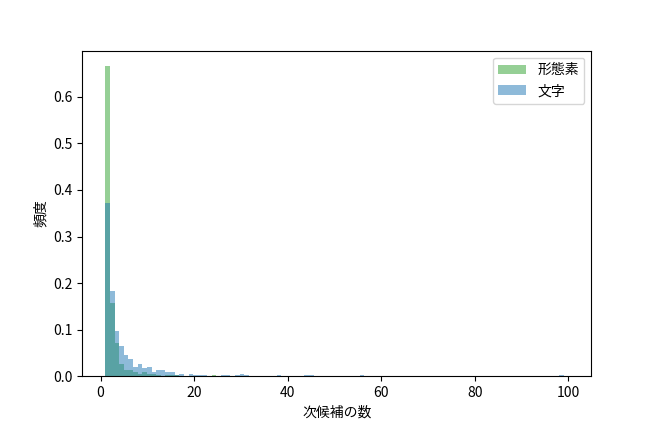
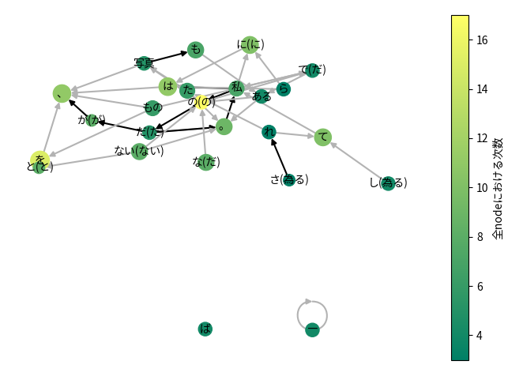
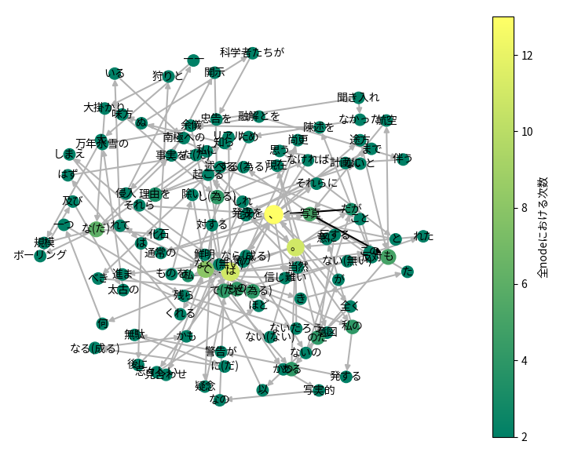

以下のテキスト[^1]を素材として、自然言語らしい文字列を自動生成するにはどうしたらよいかを考えます。

```
理由を知らぬ科学者たちが忠告を聞き入れなかったため私はこの陳述を余儀なくされた。
現在意図されている南極への侵入――大規模な化石狩りと大掛かりなボーリング及び太古の
万年氷雪の融解とを伴う計画に反対する理由を述べることは、全く以て私の意に反するのだ。
私の発する警告が無駄になるかもしれないと思うと、尚更気が進まない。
私はリアルな事実を開示しなければならないのだが、それらに対する疑念は当然起こるべき
ものである。だが、途方もないもの、信じ難いものを除いてしまえば後には何一つ残らない
だろう。これまで発表を見合わせてきた写真、通常の写真も航空写真もあるのだが、
それらは忌々しいほど鮮明かつ写実的なので私に味方してくれるはずだ。それでも尚、
それらは巧妙な捏造が可能な遠距離撮影であるため疑われることになろう。
```
[^1]: [H.P.ラヴクラフト「狂気の山脈にて」](https://www.aozora.gr.jp/cards/001699/files/57858_59672.html)より - 青空文庫

## 次の文字は

このテキストに現れる文字をランダムに並べてしまうと、もちろん意味のある言葉は作れそうにありません。
文字を全くランダムに並べるということは、一文字目を選んだあとで一文字目が何かを全く考慮せずに二文字目を選ぶということです。
それに比べるとテキスト中に現れる文字の「次の文字」というのは非常に限られていることが分かります。
試しに上のテキストの全ての文字について、例えば「理→由」のように、ある文字の次に来る文字を矢印で結ぶとFig. 1のようになります。



「ある状態から次に何を選ぶか」を示した統計過程をマルコフ連鎖と呼びますが、この図はそれを可視化したものです。 

図中では文字を示す丸が緑〜黄で色分けされており、緑は次の候補がおよそ20通り、黄色は次の候補がおよそ30通りあることを示し、丸の大きさは文字の出現頻度に対応しています。
全体的に見ると図の中心付近にある文字は丸が大きく黄色に近くなり、接続している矢印の本数が多い傾向があります。
逆に周辺にある文字は円が小さく色が緑のものが多くなり、接続している矢印が1〜2本のものが多く分布しています。
特に周辺にある文字を矢印の順にたどっていくと、元は一つの単語だったものが分割されていることが見て取れます。
中心付近は「てにをは」のような助詞や助動詞が多いようで、様々な文脈でそれが使われていることがわかります。

Fig. 1を見ると、矢印に従って文字を選び取っていけばかなり自然言語風の文字列が得られそうです。実際にこの方法で得られた文字列の例をひとつ示します。

```
理由を知らな化石狩りとを余儀なボーリング及び太古ので私はずだ。
```
意外とそれらしい文字列ができました。ですがところどころおかしなつながりになっています。
図の周辺領域で矢印の少ない丸が連続していれば、元のテキストをたどることになるので意味のある言葉に見えてきます。
一方、特に候補が多い「な」「の」「を」などが現れた点で言葉のつながりが怪しくなりそうです。
そうやって見れば得られた文字列は確かに「な」「の」「を」のところで不自然になっていることが分かります。

今の時点でも課題は多そうですが、この方法にはさらに弱点があります。
もともとテキストの自動生成はチャットボット用に大きな辞書を作ることが目的でした。
しかし文字単位のマルコフ連鎖は元になるテキストが大きくなるほど生成できるテキストの質が下がるのです。

次の候補がいくつあるかのヒストグラムを大きさの違うテキストに対して調べてみます。
Fig.1で題材にした小説の冒頭 927Byte と、同じく 21kByte を取り出して次候補の数をヒストグラムにしたものをFig. 2に示します。



大きなテキストを用いると、ヒストグラムの左端でピークが小さくなり、右に向かって裾野が長くなることが分かります。
左端が小さくなると元の単語がさらに細切れになり、裾野が広がると文脈がより無秩序にまざりやすくなります。これらが生成された文の質を低下させるのです。
文字単位でのマルコフ連鎖は「言語の種類によらず使える」ことが利点と言われています。
が、それは使い物になってからの話です。

## 次の次の文字は

文字単位でのマルコフ連鎖はあまり筋が良くないことが分かりました。 
よく知られた改善策をいくつか見ていきます。まずは前の一文字だけを見て次の文字を決めるのではなく、二文字前まで見ることにしましょう。
考慮する範囲が大きくなれば、そのぶん元のテキストに沿った範囲でテキストを生成できるようになるはずです。
考慮する文字が一つの場合uni-gram、2つの場合はbi-gram、一般的にはn-gramと呼ばれます。
これに対応して、uni-gramを利用したマルコフ連鎖を1階のマルコフ連鎖、bi-gramでは2階のマルコフ連鎖、一般的にはn階のマルコフ連鎖と呼ばれます。
実際に得られたマルコフ連鎖の一部はこのようになっています。

```
'科学': ['者'], '学者': ['た'], '者た': ['ち'], 'たち': ['が'], 'ちが'
```


また次候補をヒストグラムにするとFig. 3のようになります。青がuni-gram(先行する一文字を考慮)、赤がbi-gram(先行する二文字を考慮)です。



Fig. 3ではどちらも21kByteのテキストを用いていますが、uni-gramに比べてbi-gramは次候補の数が1である左端のピークが大きくなっており、次候補の数が2以上になる裾野の面積が小さくなっています。
これはいずれもbi-gramではテキストの無秩序化が低減される一方で元のテキストをなぞるだけになる確率が大きくなっていることを示します。


## 次の形態素は

マルコフ連鎖の改善策として、もともと単語であったものは区切らないようにするという方法があります。これを実行するには分かち書きや形態素解析を利用します。
形態素解析にはMeCabを用い、前述の小説の冒頭21kByteについて文字のマルコフ連鎖と形態素のマルコフ連鎖をヒストグラムで比べてみます(Fig. 4)。



すると、テキストのサイズが大きくても形態素のマルコフ連鎖は文字のマルコフ連鎖と比べて無秩序化が進んでいない様子が分かります。
また考慮する文字の数が増えるわけなので、高階のマルコフ連鎖、またはn-gramと同様の効果があります。
なお、テキストが無秩序化していることは統計的にある程度示せても不自然かどうかを計算で調べることは難しいようで、例えば鈴木ら[^2]はn-gramに対応したニューラルネットワークを作り、それによる判断を試みています。
しかしマルコフ連鎖で生成したテキストはそもそもn-gramのルールに則っているため、今回の場合は検出力がないと思われます。
なので、最終的にはマルコフ連鎖から生成したテキストを人間が見てそれを比べることにします。

[^2]:[鈴井 克徳ら, DEIM Forum 2018 G3-4](https://db-event.jpn.org/deim2018/data/papers/298.pdf)

## 形態素でいいの？

形態素単位のマルコフ連鎖を可視化したものをちょっとだけ工夫して観察してみます。



Fig.5では、テキストを形態素で区切った後マルコフ連鎖化し、ノードの次数(ノードにつながっている矢印の本数)の多い順に10位までに絞って表示しています。
ノードは色分けされていて、黄色は次数が高く、緑は次数が低いことを示します。なお、Fig.5で「。」を見ると入る矢印と出る矢印が合わせて5本ですが、色は黄緑色で次数が10前後となっています。
これは表示するノードを絞る前の次数を色で表しているためです。矢印にも色がついていますが、灰色だと低確率、黒は高確率でこの遷移が現れることを示しています。
次にノードのラベルは形態素の表層形、つまり実際に書かれている通りの言葉ですが、なかには同じ表層形で意味が違うとみなされたものがあり、それらは区別のためカッコ書きで基本形が伴っています。 

このFig.5を見るとこのテキストのうち頻出する遷移の様子が見えてきます。 
一番気になるのは黄色の「の(の)」というノードで、前後の形態素を矢印に従ってたどると **私→の→写真** とか **な→の→だ** といったテキストが生成されうることがわかります。
同様に **な→の→写真** も生成する可能性がありますが、これは意味がわかりません。形態素を単純にマルコフ連鎖にするとこのようなエラーが混入することがわかります。
これを避けるためには形態素解析後に **な→の** という遷移を一つのノードに再結合してしまうのがよいでしょう。
**な→の→だ** を含む文を形態素解析してみると、**な** は助動詞、**の**は助詞となっています。つまり助動詞→助詞という遷移をしています。そこで、助動詞や助詞が連続する場合は再結合することにすれば単純なルールで様々なケースに対応できそうです。

|表層形|品詞|
|---|---|
|三|名詞-数詞|
|匹|接尾辞-名詞的-助数詞|
|の|助詞-格助詞|
|白黒|名詞-普通名詞-サ変可能|
|猫|名詞-普通名詞-一般|
|な|助動詞|
|の|助詞-準体助詞|
|だ|助動詞|
|。|補助記号-句点|
  

また「三匹」のように接尾辞とそれに先行する形態素も結合してよさそうです。
さらにFig. 5を見ると「ー」が自己ループしています。これは「ーー」のような文字の連続を表しているのですが、そのままテキスト生成させると「ーーーーーーー」のように異常に長い繰り返しが出力されたりします。
そのような場合は元の文書で「ーー」を検索し、除去するか形態素解析前に予め「ーー」というノードにしてしまうといった対処が必要です。

上記の表の中には名詞の次に現れる助詞「の」があります。
一般的な自然言語処理ではこのような助詞も「単独では意味がわからない」として解析対象から除外されがちです。
また「犬が」の「が」と「吠えたが」の「が」（前者は格助詞、後者は逆接の接続助詞）であったり「田舎から」の「から」と「やってきたから」の「から」（それぞれ格助詞と順接の接続助詞）のように機能の全く異なる助詞が表層形では区別できない例がいくつか存在し、誤った文の繋がり方の原因になります。
品詞も考慮したマルコフ連鎖によりこれは軽減できますが、もう一歩進んで助詞と先行する名詞を一つのノードに結合することで、名詞の意味を超えてその役割を考慮したマルコフ連鎖が可能になります。
例えば「ロボットを買う」と「ロボットが買う」を比べると「ロボットを」は目的語、「ロボットが」は主語に相当しています。

以上をまとめ、マルコフ連鎖を利用する場合は形態素解析と以下の処理を組み合わせて前処理とすることが有効です。

* 自己ループする単語は用語辞書に記載し、形態素解析から除外する
* 表層形だけでなく、品詞も考慮したマルコフ連鎖を生成する。
* 助詞や助動詞が連続したら結合する
* 接尾辞は先行する形態素と結合する
* 格助詞は先行する形態素と結合する

これらの処理を行うために作成したツールは[Github](https://github.com/shinichi-kato/textsifter)で公開しています。
この前処理によってサイズの大きなノードや黄色に近いノードを効率的に、かつ適切に減らすことができます。
結果を比べましょう。



Fig.6はFig.5と同じテキストを用い、前処理を行った上で同じ可視化条件でプロットしたものです。
Fig.6では表示されてるノードが増えていますが、これは次数の最大値が低下し次数の上位10位という条件ですべてのノードが対象になったためです。
またそれぞれの丸についているラベルは「文節」のようなものが増え、極端に矢印が集中した「てにをは」が少なくなっていることがわかります。
 
実際に得られたマルコフ連鎖を使っていくつかテキスト生成をさせてみます。
これを見ると、前処理しなかった例ではそもそも構文的に不適切で何を言っているのかわからないレベルであったものが、前処理を行うことで少なくとも日本語的な不自然さが軽減されていることがわかります。

```
==== 前処理なし ====
* 新聞記事にて―こそが、分解してガソリンエンジン、一月十二日にはないものでも蜃気楼―心乱すニコライ・Ｈ・レーリッヒの光にしか実行できた―こそ、ペンギンが、この氷堤のカメラ、蛛形綱、通常の太陽がラジオコンパスの東岸を可能だ。
* 最終地点からのシーンのないものなボーリング可能なの活動に、ポオの峰々が、昼前についており、実際のフランク・テラー山こそ、発破用具、小さな独立した時、そこで越冬するに留まるようによっていなかった。
* ボーリング可能なペンギンたちに対応できる重量に聳え、それ以外の間、従来のアラスカ犬―にはニューイングランドの専門家とした領域だ。
```

```
==== 前処理あり ====
* 高地から吹き下ろすぞっとする東側部分――それ故、噴煙を上げるエレバス山の登攀、恐らくは大変になったことをむしろ後悔しながらロス島へと上陸を果たし、さほど世に知られ、皆、全く以て山岳地域とロス海南方の高原で行動することができたのだ。
* 西方には沢山の海豹類がゆっくりと流れる氷塊の間を上下した。
* これまでのところ南極から帰投しなければならないのだが、我々はここからアデア岬を回って、それでも我々は、大学院生の一人――我々は、大学院生の一人―特にこれは木造の捕鯨船だった。
```

この方法で機械学習が量でカバーしている問題をデータのサイズに関わらず回避できるようになり、辞書の生成とテキスト生成の両方が機械学習と比べて少ない計算量で可能になります。

