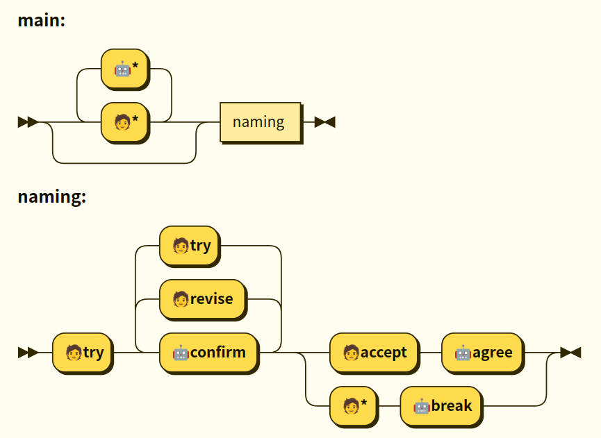

 **本ページは現在推敲中です**

## 会話の中でのユーザによるチャットボットの名付け手続き

ユーザがチャットボットにニックネームを付けるときの会話の流れとして、次のような想定をします。
ここでニックネームの提案をするときの表現は色々ありえるので、それらをまとめて「try」という内部コードで呼ぶことにします。
同様にニックネームの確認はconfirm、承諾はaccept、訂正はrevise、中止はcancelとします。以下の例ではそれを末尾にカッコ書きで表しました。

```
モデル会話 1
しずく(bot): userさん、今日は楽しかったです!
user: ねえ、しずって呼んでいい？ (try)
bot: 私にニックネームを付けてくれるんですか？いいですよ！しずですね！ (confirm)
user: ありがとう!(accept)

モデル会話 2
user: しずくのこと、ももって呼んでいい？ (try)
bot: 私にニックネームを付けてくれるんですか？もですね！ (confirm)
user: ちがう！もも！(revise)
bot: ももですね(confirm)
user: そう！(accept)
bot: はーい(agree)

モデル会話 3
user: ももって呼んでいい？ (try)
bot: もですね！ (confirm)
user: うーん、やっぱやめた(cancel)
bot: なーんだ(break)
```

モデル会話を整理して内部コードで記述してみると次のようになります。ユーザによるtryの次にチャットボットがconfirmします。confirmへの返答がreviseだった場合は再びconfirmします。
confirmへの返答がacceptだった場合チャットボットはagreeを出力して終わります。返答がcancelであればチャットボットはbreakを出力して終わります。  
ユーザの反応がチャットボットの期待したものであればこのダイアグラムにそって処理が進みますが、そうでなかった場合も考えます。

```
NG会話 1
user: ももって呼んでいい？ (try)
bot: ももですね！ (confirm)
user: 今日はいい天気だよね (?)
bot: ...

NG会話 2
user: ももって呼んでいい？ (try)
bot: ももですね！ (confirm)
user: プラムって呼んでいい? (try)
bot: ...
```

いきなり違う話題を振られたら、やんわりとしたキャンセルと見て良さそうです。つまり明確な同意以外は基本的にキャンセル扱とし、「cancel」という返答をわざわざ設定するのはやめます。
その他に予期せぬ反応としてはtryがありえますが、これはやり直しと考えていいでしょう。
これらをrailroad diagramに表したものをFig.1 に示します。Fig. 1には**main**と**naming**という2つのダイアグラムがあり、mainダイアグラムの中でnamingダイアグラムを利用しています。
namingダイアグラムのほうが名前付け手続きの本体で、それ以外の会話にも対応できるようにしたのがmainダイアグラムです。
図中で`'🧑*'`としてあるのはどの内部コードにも帰属されなかったユーザの発言で、その場合の返答を`'🤖*'`としています。



以上をチャットボットのシステムとしてまとめると、各モジュールには次のような機能が必要になります。

1. エンコーダー: ユーザ入力のうち名前を抽出する
2. 内的プロセス: 内部状態を保持し、Fig.1に従って次の動作を決める
3. デコーダー: タグで指定された名前を展開する


## 会話の中でのチャットボットによる名付けの手続き