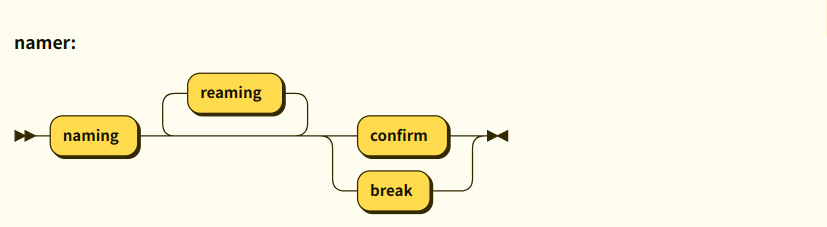

## チャットボットにニックネームを付ける
<Link to="/article/insight/3-magic/2-chatbot">呪術とチャットボット</Link>の節で議論した「名付け」の実装について考えます。  
ユーザがチャットボットにニックネームを付け、チャットボットがそれを認識して応えるというやり取りはユーザが愛着を感じる大きな要因になります。
私達は自分の本名だけで他者から呼ばれることはなく、略称、愛称を含めれば必ずニックネームを持っているのではないでしょうか。
これは言葉を話せるようになった幼児期から始まり、私達がコミュニティに参加している限りは年齢によらず使用されています。  


チャットボットの場合本名(?)は初期設定で定義する場合が多いですが、会話のやり取りを通してニックネームを与える場合はユーザの判断を認識する必要があるので、単なる辞書だけで実現するには無理があります。
そのため、状態を持った内的処理を考えましょう。名付けを以下のような要素に分解してみます。

1. 会話の中でのユーザによるチャットボットの名付け手続き
2. 名前の取得と永続的記憶および再利用
3. 不在時に呼びかけられたら現れる
4. 会話の中でのチャットボットによる名付けの手続き

まずはこの1-3について議論し、チャットボットを試作してみます。

## 会話の中でのユーザによるチャットボットの名付け手続き

ユーザがチャットボットに名前を付けるというやりとりの例をいくつか見てみましょう。

```
モデル会話 1
しずく(bot): userさん、今日は楽しかったです!
user: ねえ、しずって呼んでいい？ (naming)
bot: 私にニックネームを付けてくれるんですか？いいですよ！しずですね！ 
user: ありがとう!(confirm)
bot: しずと呼んでください

モデル会話 2
user: しずくのこと、ももって呼んでいい？ (naming)
bot: 私にニックネームを付けてくれるんですか？もですね！ 
user: ちがう！もも！(renaming)
bot: ももですね
user: そう！(confirm)
bot: はーい

モデル会話 3
user: ももって呼んでいい？ (naming)
bot: もですね！ 
user: うーん、やっぱやめた(break)
bot: なーんだ
```

ここで、ユーザがニックネームを提案するフレーズには「ねえ、〇〇って呼んでいい？」「今度から〇〇っていうね」のように様々なパターンがありえます。
それらのパターンに一致したユーザの発言には「naming」という内部コードを与えます。
同様に承諾・記憶したら「confirm」、命名のやり直しは「renaming」途中でやめることにしたら「break」とします。
このように、表面的に使われる言葉は違っていても、内部コードで見れば会話の流れはパターン化できそうです。
上述の流れをダイアグラムに表したものをFig. 1に示します。



このような流れ制御は辞書のみでは対応が難しい部分で、辞書とは別に素直にロジックを組むべき点と考えられます。

名付けはnamerダイアグラムの起点(▶▶)から始まり、まずnamingを受け取ります。
ニックネームは「宏ちゃん」のように典型的なものだけでなく「みっちー」「てるてる」など行儀の良い日本語からやや外れたものもアリです。
形態素解析はこのような例外的な日本語を扱うのが苦手なので、namingでは正規表現でユーザが提案したニックネームを抽出します。
ユーザによる名前の提案にチャットボットは「〇〇でいい？」のような確認で応じます。
それに対するユーザの反応は命名のやり直し(renaming)、承諾(confirm)、命名の中断(break)のいずれかで、renamingは何度でもやり直しの可能性がありますが、
confirmかbreakの場合は名付けを終了します。


## 名前の取得と永続的記憶および再利用

Fig. 1のnamerダイアグラムの中ではユーザが提案した名前をチャットボットが記憶します。
覚えさせた名前はブラウザを一旦閉じても覚えていてほしいため、永続的な記憶手段を使う必要があります。

チャットボットがサーバー上で動作している場合、例えばFirebaseであれば Cloud Firestore のようなサービスが利用できるでしょう。
チャットボットがブラウザ上にある場合はindexDBやlocalStorageを使用することになります。

チャットボットがもともと持っている名前に加えて、新たに覚えた名前は以降のやり取りでチャットボットの名前として認識するようになります。
これを便利に扱うため、入力文字列に名前が含まれていたらそれを{BOT_NAME}のようなタグに置き換える処理を行います。

つまりencoderでは「`啓太今日来てる？`」を「`{BOT_NAME}今日来てる？`」のように変換します。
ここでニックネームも同じようにチャットボットの名前であると解釈するため、
例えば「けいちゃん」というニックネームが新たに与えられた場合、「けいちゃんいる？」が新たに「{BOT_NAME}いる」になるようencoderの出力が変化します。


## 不在時に呼びかけられたら現れる

その場にチャットボットがいない時に呼びかけられたら現れる、という動作を実現するためには**チャットボットの不在**という状態を実装する必要があります。
これを再び会話例で見てみましょう。
```
モデル会話4
※botはabsent状態で起動
user:おーい
user:いないのかな？
user:啓太〜〜(summon)
bot:はーい
```

このように、不在状態は「absent」から始まり、「summon」が来ない限り返事をしないというようにパターン化できそうです。
不在状態、通常のチャットボットの応答、そして命名(namer)を組み合わせた状態機械の全体像をFig. 2に示します。


これまでに説明したチャットボットのデモンストレーションがこちらです。
このチャットボットは不在状態から始まります。名前は「ミドリ」なので、名前を呼びかけてみてください。
ミドリが現れたら「〇〇って呼んでいい？」と素敵なニックネームをつけてください。以降はそのニックネームでもミドリが返事をするようになります。

<Chatbot source='/chatbot/namer' options={{startingState: 'absent'}}/>

