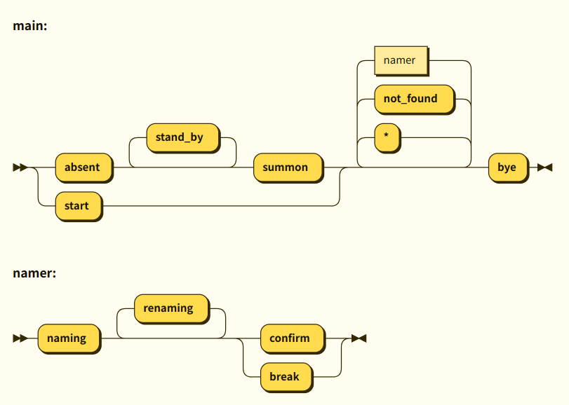

 **本ページは現在推敲中です**

## チャットボットにニックネームを付ける
<Link to="/article/insight/3-magic/2-chatbot">呪術とチャットボット</Link>の節で議論した「名付け」の実装について考えます。  
ユーザがチャットボットにニックネームを付け、チャットボットがそれを認識するというやり取りはユーザが愛着を感じる大きな要因になります。
それはペットとして飼っている犬や猫でもよく見られ、ペットの名前ランキングが行われていることからも分かります。 
チャットボットの場合本名(?)は初期設定で入力する場合が多いですが、会話のやり取りを通してニックネームを与えるという行動はユーザの判断を認識する必要があるので、単なる辞書だけで実現するには無理があります。
そのため、状態を持った内的処理を考えましょう。名付けには以下のような要素技術に分けられそうです。

1. 会話の中でのユーザによるチャットボットの名付け手続き
2. 名前の取得と永続的記憶および再利用
3. 不在時に呼びかけられたら現れる
4. 会話の中でのチャットボットによる名付けの手続き

まずはこの1-3について議論し、チャットボットを試作してみます。

## 会話の中でのユーザによるチャットボットの名付け手続き

ユーザがチャットボットに名前を付けるというやりとりは、例えば次のような流れになります。
ユーザがニックネームを提案するフレーズには「ねえ、〇〇って呼んでいい？」「今度から〇〇っていうね」のように様々なパターンがありえます。
それらのパターンに一致したユーザの発言には「naming」という内部コードを与えます。
同様にチャットボットが名前の確認をすることを「confirm」、承諾・記憶したら「memorized」、途中でやめることにしたら「break」とします。

```
モデル会話 1
しずく(bot): userさん、今日は楽しかったです!
user: ねえ、しずって呼んでいい？ (naming)
bot: 私にニックネームを付けてくれるんですか？いいですよ！しずですね！ (confirm)
user: ありがとう!
bot: しずと呼んでください(memorized)

モデル会話 2
user: しずくのこと、ももって呼んでいい？ (naming)
bot: 私にニックネームを付けてくれるんですか？もですね！ (confirm)
user: ちがう！もも！
bot: ももですね(confirm)
user: そう！
bot: はーい(memorized)

モデル会話 3
user: ももって呼んでいい？ (naming)
bot: もですね！ (confirm)
user: うーん、やっぱやめた
bot: なーんだ(break)
```

このやり取りは通常の会話の中で始まり、やり取りが終わったら通常の会話に戻るサブルーチンのような構成になります。
その全体像をダイアグラムに表したものをFig. 1に示します。


チャットボットはmainダイアグラムの起点(▶▶)から始まり、startを受け取ったら挨拶を表示し、その後ユーザから受け取った入力によってnaming, not_found, byeなどに分岐をします。
namingを受け取ったらnamingダイアグラムに移動し、名前を受け取ることに成功するか(memorized)、名付けが中止されるか(break)したらmainに戻ります。

## 名前の取得と永続的記憶および再利用

ニックネームは「宏ちゃん」のように典型的なものだけでなく「みっちー」「てるてる」など行儀の良い日本語からやや外れたものもアリです。
形態素解析はこのような例外的な日本語を扱うのが苦手なので、正規表現でニックネームを抽出する方が適しています。

ニックネームはユーザが後から与えるものなので、チャットボットの辞書にあらかじめ書いておくことができません。


辞書のin文字列には

抽出できたニックネームは本名と同じように扱われ、ユーザ入力の解析でチャットボットの名前として認識される必要があり、チャットボットの出力でも活用します。

まず入力文字列では
```
みっちーに聞いてみよう → {bot}に聞いてみよう
```
のようにニックネームはタグに置き換えます。出力辞書では逆に、辞書を読み込む際にチャットボットの名前を{bot}に置き換えておき、

```
{bot}と呼んでください → みっちーと呼んでください 
```

のように復元します。
取得したニックネームは直後の会話や翌日以降の会話でも有効であってほしいため、ブラウザのlocalStorageやサーバーに保存される必要があります。


### 再帰的タグ展開

## 不在時に呼びかけられたら現れる

その場にチャットボットがいない時に呼びかけられたら現れる、という動作を実現するためには**チャットボットの不在**という状態を実装する必要があります。




<Chatbot source='/chatbot/namer'/>


