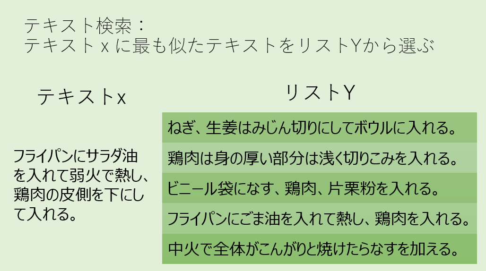
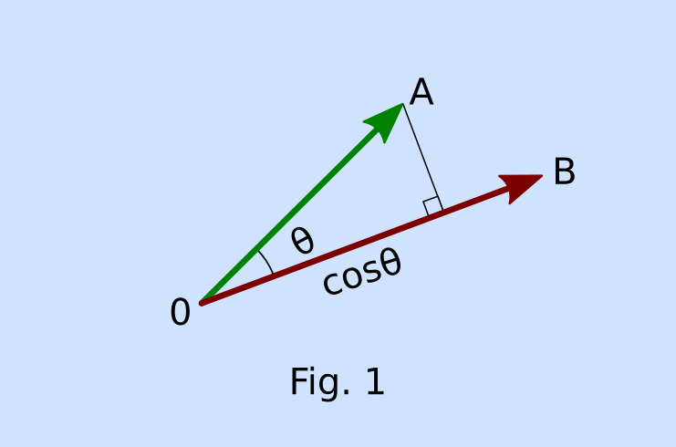
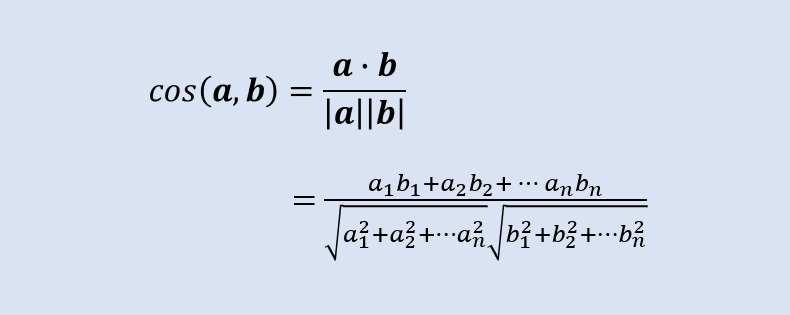

**テキスト検索(Text Retrieval)**は検索エンジンにも使われている、よく知られた機械学習の技術のひとつです。古いチャットボットではこのような方法はは使われていませんでしたが、今日では人工知能の技術がチャットボットにも利用されるようになっています。テキスト検索は***テキストx*** **に最もよく似たテキストを** ***リストY*** **の中から選択する**という問題を解くことと言い換えることができます。また、ここでいう**テキスト**とは自然言語として有効な文字列を示します。



テキストxは自然言語ですから、名詞、動詞、副詞などの並びです。そして、例えば「フライパンにごま油を入れて」と「ごま油をフライパンにいれて」という２つの文は、単語の順番が一部入れ替わっていますが意味は同じです。つまり語順が変わっても良い場合があるという特徴があります。そこで、単純化のために単語の現れる順番は無視して、
`
「テキストxとテキストyが似ている」ということは「xとyに共通して含まれる単語が多い」
`
と考えることにしましょう。その手順を要約すると以下のようになります。

1. 形態素解析
2. テキストのベクトル化
3. cos類似度計算


## 1.形態素解析

さてここで、テキストが似ているかどうかを比べるには単語ごとに分解する必要があることになりました。英語では単語と単語がスペースで区切られておりなんの苦労もないのですが、日本語はスペース区切りになっておらず単語の区切り方は単純には決められません。これを行うのが**形態素解析**と呼ばれる技術です。日本語の形態素解析器としてはChasenやMeCab、nagisaがよく知られています。nagisaを使うと、テキストは次のように分解されます。

```md
フライパン/名詞 に/助詞 サラダ/名詞 油/接尾辞 を/助詞 
入れ/動詞 て/助詞 弱火/名詞 で/助詞 熱し/動詞 、/補助記号
鶏肉/名詞 の/助詞 皮側/名詞 を/助詞 下/名詞 に/助詞 
し/動詞 て/助詞 入れる/動詞 。/補助記号
```
これを見ると、単語が名詞や助詞、動詞などに分類されていることがわかります。この品詞の情報はとても興味深いのですが、今回は単語だけを利用します。なお、品詞の情報は不要で分割だけ行うことを**分かち書き**と呼びます。

## 2.テキストのベクトル化

形態素ごとに分割したテキストについて、**現れる単語の数を数える**というのがベクトル化を行う一つの方法です。テキストをベクトル化するにはそれにはpythonのscikit-learnに含まれている`CountVectorizer`が使えます。以下のようにすればテキストを分かち書きし、CountVectorizerでベクトル化できます。

```py
from sklearn.feature_extraction.text import CountVectorizer
import pandas as pd
import nagisa

pd.set_option("display.max_columns" 10)

texts = [
    "フライパンにサラダ油を入れて弱火で熱し、鶏肉の皮側を下にして入れる。" # x
    "ねぎ、生姜はみじん切りにしてボウルに入れる。"     # y0
    "鶏肉は身の厚い部分は浅く切り込みを入れる。"       # y1
    "ビニール袋になす、鶏肉、片栗粉を入れる。"          # y2
    "フライパンにごま油を入れて熱し、鶏肉を入れる。"   # y3
    "中火で全体がこんがりと焼けたらナスを加える。"        #y4
]

def tokenize(doc):
    doc = nagisa.tagging(doc)
    return doc.words

    
vectorizer = CountVectorizer(tokenizer=tokenize)
matrix = vectorizer.fit_transform(texts)

df = pd.DataFrame(matrix.toarray()
                        columns=vectorizer.get_feature_names())

print(df)
```

結果、得られるベクトルはこのようになります。

|index| 、| 。| が | ごま | ... | 皮側 | 身 | 部分 | 鶏肉 |
|---  |---|---|---|--- | --- |--- |---|---|--- |--- |
|x    | 1 | 1 | 0 |  0 | ... |  1 | 0 |  0 |  1 |
|y0   | 1 | 1 | 0 |  0 | ... |  0 | 0 |  0 |  0 |
|y1   | 0 | 1 | 0 |  0 | ... |  0 | 1 |  1 |  1 |
|y2   | 2 | 1 | 0 |  0 | ... |  0 | 0 |  0 |  1 |
|y3   | 1 | 1 | 0 |  1 | ... |  0 | 0 |  0 |  1 |
|y4   | 0 | 1 | 1 |  0 | ... |  0 | 0 |  0 |  0 |

このひょうを見ると、「。」はどのテキストにも含まれていることがわかります。一見すると有力な情報のような気もしますが、どのテキストを見ても同じであれば判別の材料にはならず、かえってノイズになります。他にも排除すべき単語はないのでしょうか。このベクトルを構成する単語を列挙すると、

```md
、 。 が こんがり ごま し たら て で と なす 
に ねぎ の は みじん を サラダ ナス ビニール 
フライパン ボウル 下 中火 入れ 入れる 全体 
切り 切り込み 加える 厚い 弱火 油 浅く 焼け 
熱し 片栗粉 生姜 皮側 袋 身 部分 鶏肉 (全43単語)
```

「てにをは」的なものがいろいろ含まれています。「てにをは」自体にはあまり意味がないため、ざっくり**句読点と一文字のひらがなは排除する** という方針で良さそうです。このようにベクトル化する前に除去する単語を *stop words*と呼びます。
stop wordsは`CountVectorizer`でもサポートされています。

```py
stop_words=['、','。','が','し','て','で','と','に','の']
vectorizer = CountVectorizer(
    tokenizer=tokenize,
    stop_words=stop_words)
```

これにより、先程よりノイズの少ないベクトル化ができました。

|index | こんがり | ごま | 油 | なす | ... | 皮側 | 身 | 部分 | 鶏肉|
|---| ---| ---|--- |--- | --- |--- |---|--- |--- |
|x  |  0 |  0 |  1 |  0 | ... |  1 | 0 |  0 |  1 |
|y0 |  0 |  0 |  0 |  0 | ... |  0 | 0 |  0 |  0 |
|y1 |  0 |  0 |  0 |  0 | ... |  0 | 1 |  1 |  1 |
|y2 |  0 |  0 |  0 |  1 | ... |  0 | 0 |  0 |  1 |
|y3 |  0 |  1 |  1 |  0 | ... |  0 | 0 |  0 |  1 |
|y4 |  1 |  0 |  0 |  0 | ... |  0 | 0 |  0 |  0 |

## 3. cos類似度

テキストをベクトルとして表すことができたら、cos類似度を用いて2つのベクトルがどれくらい似ているかを計算します。cosθは２つのベクトルの角度が一致していたら1、ベクトル間の角度が90°であれば0、ベクトルが逆向きであれば-1になり、ベクトル**a**=(a1,a2,... an)、**b**=(b1,b2,...,bn)のとき次の式のように定義されます。





ここで式の分母はベクトル**a**、**b**の長さになっており、分子である**a**と**b**の内積を長さで規格化していることになります。テキストのベクトルの長さを規格化するとはどういう意味でしょうか。テキストが長いほど使われる単語の数は多くなります。すると分子である内積の値も大きくなるため、規格化しない場合はテキストが長いというだけでより似ていると判断される傾向が出てきます。逆に見れば短いテキストは類似度が高いと判定されにくくなります。雑談におけるテキストに置き換えて考えると、特に日本語の場合は会話の中で共通して認識されている主語や述語、目的語が省略される傾向があります。例えば

>A: 先生はどこに行ったか知らない？
>B: 教室だと思います。

の場合、Bは「思います」の主語がB自身であることを省略し、「行った」という述語を省略し、目的語である「教室」述語の「思います」だけを発言しています。このような省略が多いほど文脈的には明確になっていて文脈上重要な意味を含んでいると考えることができます。そのため、テキストのベクトルを規格化することで、短いテキストにおける単語の重みをより強めることができます。  

また、規格化を前提とすることで|**a**| = |**b**| = 1となるため、類似度の計算式は


となります。
