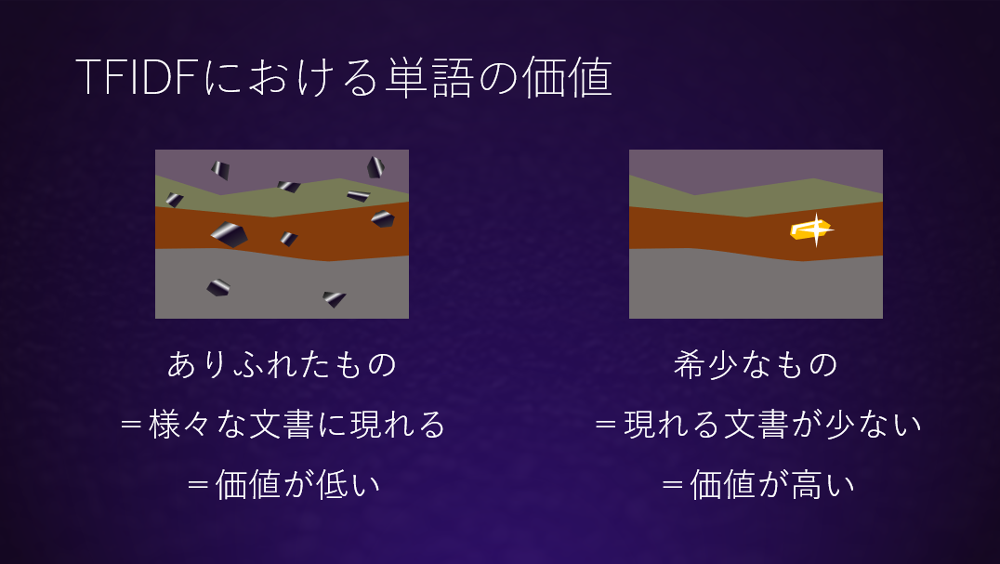
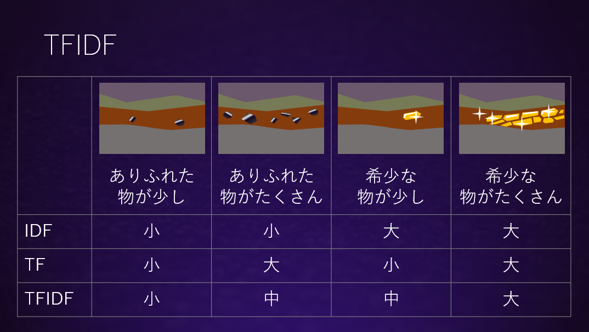
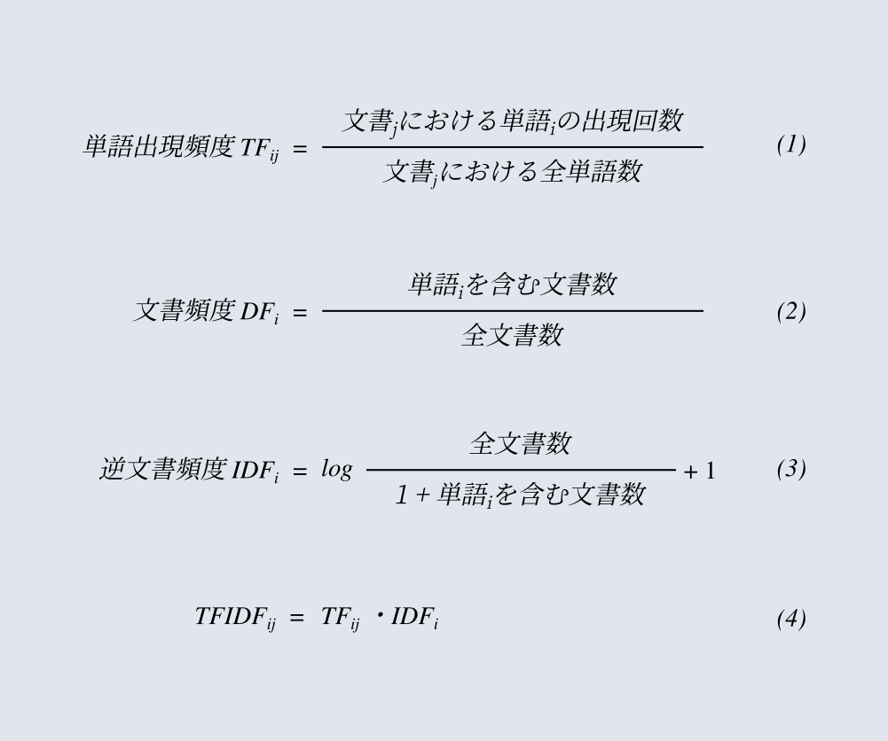

[似たテキストを探す(2)](../text-retrieval/)ではテキストをベクトルとして表現し、ベクトル同士の類似度を使って似たテキストを探す方法を見てきました。このベクトルはテキストに含まれるそれぞれの単語の個数を成分とし、２つのベクトルがどれくらい似ているかの評価にcos類似度を用いました。この方法では単語の並び順は無視し共通して含まれる単語の数が多いほど類似したテキストであるとみなされました。それは一見するとテキストの類似を正しく評価できているように思われますが、うまくいかない場合もあります。次の例を見てみましょう。人間が読めば、もちろんAとBは似ておらず、BとCは似ていることがひと目でわかります。ここで、

> A: テキスト | が | 似て | いる  
> B: 鶏肉 | が | 入って | いる  
> C: 鶏肉 | を | 入れ | た

A~Cはいずれも4つの単語で構成されたテキストです。長さは同じなので似ているかどうかは共通する単語の数で比べることができます。それを調べてみると、

|関係|共通する単語 | 共通する単語の個数 |
|:---:| :---: | :---: |
|A-B| が, いる | 2 |
|B-C| 鶏肉 | 1 |
|C-A|  | 0 |

となり、A-BのほうがB-Cよりも似ていることになってしまいました。おかしな結果になったのは「が」や「いる」のようにほとんど意味のない割に数の多い単語が混在しているためのようです。これを改善するため、古くは形態素解析で名詞や動詞だけを特定しそれ以外を除去する方法などが検討されましたが、形態素解析エンジンとその辞書が巨大であることに加え、チャットのように形態素解析用の品詞辞書にない新しい言葉や謎のスラングが含まれやすいテキストでは効果は限定的でした。その一方で長い文書同士の比較と比べ、チャットのようにテキストが短い場合には少ない単語からより精度良く比較を行う方法が必要です。そこで、統計的な手法を用いてテキスト分析の精度を高めるために考案された手法の一つである、TF-IDFを利用します。

## TF-IDF

TFIDFは**希少な単語は価値が高く、ありふれた単語は価値が低い**という考え方で、チャットボットの辞書に現れるそれぞれの単語に価値に基づくスコアを与える計算方法です。最もありふれた単語の一例は「を」などで、どの文書にでも現れるような単語ではテキスト間の比較をする材料になりません。その意味で価値が低いと言えます。逆に単語がとても限られた文書にしか含まれていなければテキストは特徴的なものになり、テキストを比較する根拠になりやすく、単語は価値が高いと言えます。

この単語の価値は *単語iを含む文書数 / 全文書数* で定義される**DF**(Document Frequency,文書頻度)という指標で表されます。ここでDFの値は単語が希少であるほど小さい値になるため逆数である**IDF**(Inversed Document Frequency,逆文書頻度)を用います。また希少性の重み付けを調整するためlogをとることがよく行われます。この方法では辞書に含まれる単語の希少性は計算できるのですが、チャットで辞書にない単語が出現した場合式の分母である単語iを含む文書数が0になり、logの計算ができなくなるため分母には1を加えます。また分母に1を加えた場合、100県の文書全てに含まれる単語のIDFを計算すると log(100/101)=-0.004 と異常な値になってしまうので、これを防ぐため1を加えます。  

次にTFIDF計算では一つのテキスト含まれる対象の単語iの頻度も考慮されます。これはある文書について *単語iの出現回数 / 全単語数* で定義される**TF**(Term Frequency)という指標で表されます。このTFとIDFの積がTFIDFになるわけです。これを定性的に表してみます。

IDFは希少性、TFは多寡を表します。ありふれた単語が少しある場合は積であるTFIDFは小さい値になります。ありふれた単語がたくさんある場合はそれよりTFIDFは大きくなります。次に希少な単語が少しある場合はIDF値が大きいためTFIDFは小さくはなく、希少な単語がたくさんある場合はTFIDF値は大きくなります。  

上述の各指標の定義を以下に示します。

