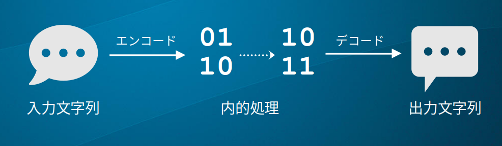
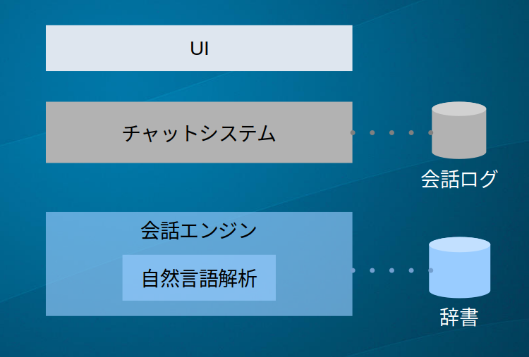
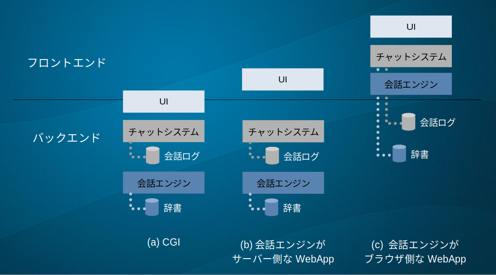

チャットボットは私達が普段使っている日本語や英語を利用してユーザとコミュニケーションするプログラムです。
実際に動いているチャットボットには様々な工夫が盛り込まれているのですが、まずはこれをできるだけ簡単にしてエッセンスの部分だけを取り出してみます(Fig.1)。

チャットボットにはユーザから様々なメッセージが*入力文字列*として与えられます。
メッセージはそれぞれ意味を持っており、例えば「おはよう」や「こんにちは」の意味は「挨拶」です。
この意味を解釈できて初めてチャットボットは対応ができるため、チャットボットはチャットボットなりに入力文字列を分類して解釈を試みます。
最先端の人工知能であっても日本語を人と同じレベルで理解することは到底できないので、チャットボットの解釈は精度が低く表面的なものになるという限界があります。
そして人間であれば意味には「挨拶」などの呼び名がつきますが、チャットボットの場合は代わりに数字の羅列などのデータとして表現し、それを*内部コード*と呼びます。
次に人の場合「挨拶」を受け取ったと理解したら時間や相手、今の気分、シチュエーションなどを考慮して返事を決めます。
チャットボットでもその部分は工夫のしどころなのですが、最も単純には内部コードに対して常に決まった出力文字列を生成し、返事とします。

これを整理すると、

1. 入力文字列を何らかの内部コードに読み替える**エンコーダー**、
1. **内部コード**
1. その内部コードから出力文字列を作り出す**デコーダー**

という三つの要素に分解できることがわかります。

エンコーダーは更に、入力文字列を分割する**分割部**と分割した文字列を何らかのベクトルに変換する**ベクトル化部**に分けられます。
実際によく用いられるエンコーダーのひとつに「辞書の中から似ている文を探す」という方法があります。
まず分割部ではテキストを形態素などにわけ、ベクトル化部では得られた形態素ごとに数を数えたものをベクトルとして表します。
ベクトル化した入力文字列と、同じくベクトル化した辞書の各行がそれぞれどれくらい近いかを0~100%で表します。
下に辞書の例が書かれています。その下にテキストフィールドがありますので、そこに辞書に似た文字列や似ていない文字列を入力してみてください。
右端に計算された類似度が表示されます。

<RetrieverDemo source={'/chatbot/text-retriever-demo.json'}/>

そしてこの例の場合、辞書の行番号が内部コードになります。
デコーダーでは行番号ごとにあらかじめ用意された返答の中からランダムに一つを選ぶなどの方法が使われます。

ここで、デコーダーが返事の代わりにウェブサイトのURLを出力してきたとしたらどうでしょうか？それはgoogleのような検索エンジンになります。
辞書がすべてひらがなで、デコーダーがそれを漢字で表したものであれば漢字変換エンジンができます。
入力が英語で、出力が同じ意味の日本語であれば、機械翻訳ができるかもしれません。
つまり、チャットボットとは呼ばれていないものの、似ているプログラムは身近なところにあちこち存在しているのです。

# チャットボットのシステム

上で説明したチャットボットの核となる部分だけではアプリとして成り立ちません。そこで一例としてこの核を組み込んだチャットアプリを考えます。

## チャットボットシステムの基本的な構成

チャットボットシステムを機能別に分解すると、**UI**(ユーザインタフェース）、**チャットシステム**、**会話エンジン**のブロックに分けることができます(Fig. 2)。
通常のデータの流れでは、ユーザが発言するとその内容はUIを介してチャットシステムに渡され、会話ログに保存されるとともに会話エンジンにも渡されます。
会話エンジンには**エンコーダ**、**デコーダ**が含まれ、エンコード用辞書、デコード用辞書を利用します。
また場合によって時刻などユーザの発言以外の**内部入力**をきっかけとして**内部コード**を生成します。
このチャットボットの返事はチャットシステムに渡り、会話ログに追記されるとともにUIに渡され、画面上に描画されます。

チャットシステムはユーザ認証、ユーザの名前やアバターの管理、ログの管理、チャットルームの管理などの機能を持ちます。
共通のログのようにサーバーでの一元管理が必要な場合は、バックエンドとして何らかのデータベースを利用することになります。

## システム構成の例

さらに具体的なアプリケーションを考えてみましょう。
チャットシステムはweb上で複数の人が利用することが前提です。そのためフロントエンド+バックエンドという構成が必要です(Fig. 3)。

この構成のうち、2000年代あたりに主要だったのはFig. 3(a)のCGIです。
CGIではバックエンド側ですべての処理を行い、完成したhtmlをブラウザ側に送ります。ブラウザは基本的に表示するだけです。
この方法ではチャットのように一行づつ表示が増えるものであっても毎回全画面の書き換えをすることになり、今では効率はよくないとみなされています。
一方でプログラムの構造は比較的単純でpython,ruby,perl,Cなど様々な言語で対応できます。

2010年代以降はブラウザ側でも計算処理を行い、チャット中の通信を効率化した**WebApp**という構成が一般的になりました。
このうちチャットボットが常時稼働している必要がある場合は会話エンジンやチャットシステムをバックエンドに置いた構成にします(Fig.3(b))。
その場合はバックエンドとして常時稼働しているサーバーが必要になります。Amazon Web Services(AWS)やGoogle Cloud Platform(GCP)などのクラウドコンピューティングサービスが適しているでしょう。

ユーザがブラウザを開いている間だけチャットボットが稼働すればよい場合はブラウザ側にすべてのプログラムを置き、バックエンドにはログ機能とホスティングの機能のみを残す方法がとれます(Fig. 3(c))。
Firebaseは後者の構成に適しています。

## 「チャットボットを作る」

さて、ここまでで初歩的なチャットボットについてアプリケーションとしての構成を大まかに見てきました。
この先本章ではエンコーダーやデコーダーの詳細を始め、周辺技術やチャットボットならではの工夫について論じていこうと思います。
これらの中には機械学習の技術が応用されたものもあり、その意味では現代のチャットボットは人工知能の一種と呼んで良いのかもしれません。 

機械学習を扱っていると、「思ったように性能が出ません。深層学習を試してみようと思うのですが！」と考える開発者をまま見かけます。
このようなアプローチは多くの場合うまく行きません。
よくある失敗の一つは**どんなデータが必要なのか理解されておらず、手当たりしだいに集めたデータでなんとかしようとする**というものです。
開発者はみなさん自分が何をしたいのか分かっていると思っています。ところが、詳しく話を整理していくと実はモヤの中にいるケースがほとんどです。
そんな状態で集めたデータは、例えて言うなら漫画10作品からランダムにページを抜き取り作品もページもシャッフルして作った一冊の本のようなものです。
いくら性能の良い機械学習を持ってきたところで意味のわかる物語を読み取ることはできません。

チャットボットでもそれは同じです。目的に沿ったデータとそれに適したプログラムの両方が重要です。
そこで本サイトでは「何を作るか」の部分を**心をめぐる考察**の章で探り、「どう作るか」を本章で検討します。

 
  

 <Flavor 
 authority="Isac Asimov"
  work="「災厄のとき」 - われはロボット(1950)"
>
  「マシン」はしょせん機械です。
計算とか判定という重荷を人間の肩からとりさることによって人間の進歩を早める役には立ちますよ。
しかし、人間の脳の仕事は相変わらず残っている。
つまり、分析すべき新しいデータを発見すること、検査する新しい概念を考え出すことだ。
</Flavor>