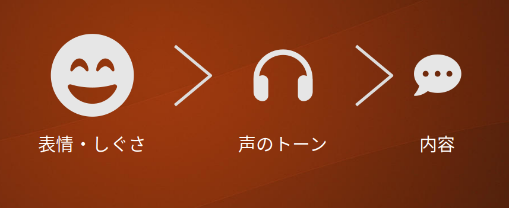

私たちが誰かと対面でコミュニケーションするとき、意識せず様々な感覚を使っています。  
視覚により相手の表情、たたずまい、心理的な距離などを推し量ることができます。
聴覚では相手が機嫌が良いか、調子が悪いか、怒っているかなどの感情がわかります。
例えば小さい子とその子を抱っこした親のように相手に触れた状態の会話であれば、触れることが可能な時点で心理的距離が小さいことがわかり、
相手の体調や本心の一部まで伝わることがあります。
香水やお香を利用することで、場の雰囲気をリラックスさせたり心地よいものにする人もいるでしょう。
これらに加えて話の内容自体は聴覚とは別に認識しています。

メラビアンによれば、ごく一般的なコミュニケーションでは表情やボディランゲージによる**視覚情報(Visual)**、声のトーンやスピードなどの**聴覚情報(Vocal)**、
会話の内容である**言語情報(Verbal)**の三つのモードが使われます。
そしてこれらの各モードから得られる情報が矛盾していたとき、つまり言葉では「いいよ」と言っているのに表情は怒っているような場合は**視覚**、**聴覚**、**言語**の順に優先して認識されるといいます。

チャットボットは主に言葉を使いますが、コミュニケーションをより効果的にするためにこれらのモードを考慮することは有用です。

## 視覚情報
チャットボットのシステムで視覚情報といえばまずアバター画像です。スマートフォンのように限られた画面を使う場合もありますが、
アバター画像を大きめにすることで伝えられる情報は豊かになります。

**視覚情報**# 
吹き出しの形状、発話のスピードや間のとり方、顔文字などを利用した**聴覚**系の代替情報、そして**内容**の三つです。

これらのモードには人間が影響を受けやすい順序があると言われており、**視覚**、
