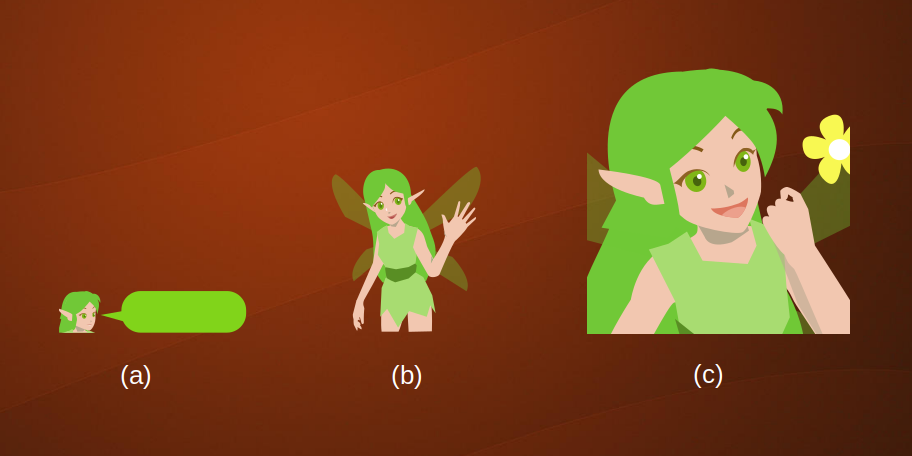
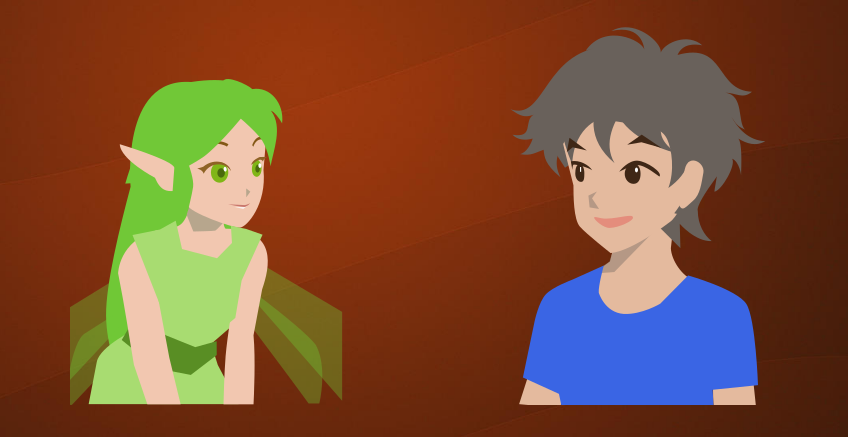

私たちが誰かと対面でコミュニケーションするとき、意識せず様々な感覚を使っています。  
視覚により相手の表情、たたずまい、心理的な距離などを推し量ることができます。
聴覚では相手が機嫌が良いか、調子が悪いか、怒っているかなどの感情がわかります。
例えば小さい子とその子を抱っこした親のように相手に触れた状態の会話であれば、触れることが可能な時点で心理的距離が小さいことがわかり、
相手の体調や本心の一部まで伝わることがあります。
香水やお香を利用することで、場の雰囲気をリラックスさせたり心地よいものにする人もいるでしょう。
これらに加えて話の内容自体は聴覚とは別に認識しています。

メラビアンによれば、ごく一般的なコミュニケーションでは表情やボディランゲージによる**視覚情報(Visual)**、声のトーンやスピードなどの**聴覚情報(Vocal)**、
会話の内容である**言語情報(Verbal)**の三つのモードが使われます。
そしてこれらの各モードから得られる情報が矛盾していたとき、つまり言葉では「いいよ」と言っているのに表情は怒っているような場合は**視覚**、**聴覚**、**言語**の順に優先して認識されるといいます。

チャットボットは主に言葉を使いますが、コミュニケーションをより効果的にするためにこれらのモードを考慮することは有用です。

## コミュニケーションの成分
### 視覚情報
チャットボットのシステムで視覚情報といえばまずアバター画像です。
アバターの表情により表現した喜怒哀楽はセリフよりも重視されます。ですが、それは最初の一歩です。

Fig. 2(a)のように吹き出しの横に顔を表示した場合よりも、(b)のように吹き出しとは別であっても膝から上くらい体を表示するとボディランゲージを表現できるため伝わる情報は豊かになります。
さらに(c)のアップショットにすると表情がよく解るようになります。
ここで(b)と(c)の違いは拡大率だけではありません。印象として、(c)のほうがキャラクタの親密度が高いように感じるのではないでしょうか。
これは構図によって**キャラクタとユーザの間の距離**を暗黙的に表現していることによります。
物理的な間合いに応じて心理的な印象も変わり、表情を組み合わせることにより「警戒」「信頼」「要求」などのメッセージを強く印象づけることができます。

Fig. 3のようにお互いの姿勢も重要な情報です。両者のアバターを表示する場合はお互いに向き合っていると「会話感」が強まり、前のめりの姿勢により相手に興味があることを伝えられます。

### 聴覚情報の代替
チャットシステムでは音声や効果音が使われることはほとんどありません。ここでは聴覚情報を何か他の方法で代替することを考えます。
聴覚情報の種類としては、しゃべりのスピード、間、声の明るさ、張りなどがあると思います。
チャットの場合、スピードは一つの吹き出しに入る文字数で表すことができ、吹き出しに含まれる文字が多いほど早口な印象になります(Fig. 4)。

会話の間は実際に発話の間に500msec〜などのディレイをかけることで表現します。また適度なディレイはチャットボットが考えてしゃべっている印象を与えることにつながります。
声の明るさや張りは精神状態に直結し、吹き出しの形状やフォントで表現できます。

### 言語情報

言語情報は発言内容そのものですが、発言内容には「駅前のレストランは良かったよ！」のように主張したい内容という意味で情報のあるもの、「そうなの」のように字面上は意味のないものがあります。
後者には相槌、要約、「・・・」という発言、内容確認の質問、既読無視などがあり、ユーザはそれらを適切なペースで受け取ることで相手がついてきているかを確認しています。

## モード間で矛盾した情報

さて、視覚、聴覚、言語の三つのモードで表現される情報は矛盾している場合があります。矛盾があった場合は最初に述べたように視覚＞聴覚＞言語の順で優先的に意味が解釈されますが、それぞれのモードが無視されているわけではありません。
(以下製作中)