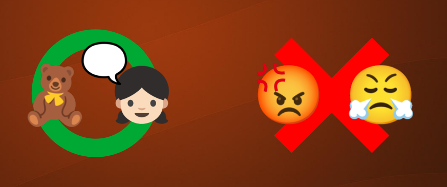

チャットボットは一般に言葉を使ってユーザとコミュニケーションすることを目的にしています。
では、コミュニケーションの条件とはなんでしょうか。

小さい女の子はクマのぬいぐるみとお話できます。一方言葉が通じる大人同士であっても、喧嘩している相手とは雑談はできません。
このように考えると、コミュニケーションにとって言語とは必要条件でもなく、十分条件でもないと言えそうです。
それではコミュニケーションから言語を除いた残りはどんなもので、言語と比べてどのくらいの割合を締めているのでしょうか。
これがコミュニケーションについて考える出発点です。