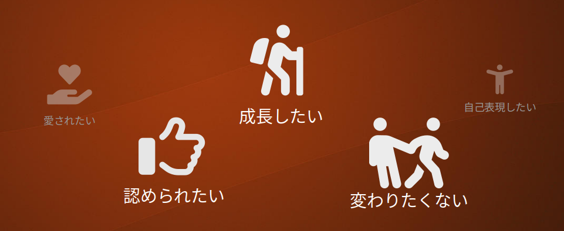

チャットボットの草創期に作られたElizaは、ロジャー派の心理療法家の技法をざっくり真似した会話をするように作られました[^1]。
この技法は傾聴と呼ばれて広く知られていますが、今日ではコーチングで使われるシンプルなものからカウンセリングで用いる綿密で奥深いものまで、さまざまな「傾聴」があるようです。
そこで今回は古宮昇の著書「傾聴の基本」をもとにこれを見ていきたいと思います。 
 
一般的に傾聴は相手の言葉に耳を傾けることを意味しますが、古宮はこれを**話し手が表現していること、伝えたいことや気持ちを、できるだけ話し手の身になって想像して理解し、理解したことを相手に言葉で返すこと**[^2]
だとしました。

[^1]: ["ELIZA—a computer program for the study of natural language communication between man and machine", Communications of the ACM 9(1)](https://dl.acm.org/doi/10.1145/365153.365168)
[^2]: ["古宮昇, "傾聴の基本"(総合法令出版, 2020年)"](https://amzn.to/3yfNP8f)

それでは、ここでいう「表現していること」「伝えたいこと」とは何でしょうか。
例えば話し手であるAさんが「部活でBさんがなかなか協力してくれないんですよ。」という悩みを伝えてきた場合、表面的にはBさんの問題点をAさんが説明しているわけですが、それに対して
「じゃあ先輩に言ってBさんの態度を直してもらいましょうか」のような提案をしても、本当の意味では解決になりません。
BさんにはBさんの理由や考えがあるかもしれません。先輩から頭ごなしに「Aさんに対する態度を直してよ」などと言われたらBさんの気持ちや態度は一層硬化し問題は悪化するでしょう。
では話し手Aさんの問題点を聞き出して指摘したらどうでしょうか。Aさんにしてみたら「私を助けてほしかったのに、なんで怒られなきゃいけないの？!」と思うでしょう。 
これは話し手が本当に解決したかった状況ではないでしょう。
本当に言いたいことというのは実際、なかなか表面に現れてこないものです。
何を言いたかったのか、さらにそこに隠れた本音は何だったのかと探っていくと、いくつかの「〇〇したい」にたどり着きます。

## 心の原動力

私達は**成長したい**という気持ちを心の奥底で強く持っています。  
スポーツやゲームでより強くなり、高い成績を出せるようになることで私達は達成感を感じます。スポーツ観戦やゲーム実況動画に人気があるのは達成感を追体験させてくれるから、という面があるでしょう。
新しい料理を覚えたり、料理がうまくなったりすると嬉しくなります。
一方で新しいことをするときは失敗はつきものです。例えば自転車は最初はだれでもうまく運転できません。
乗り始めたばかりの頃はペダルの漕ぎ方、倒れないようにすること、ハンドルの操作方法など様々なことを同時に考え、何度も倒れながら少しずつ乗り方を分かっていきます。
倒れることで怪我をすることもあるでしょう。ですが、親がその失敗を恐れて「自転車に乗るな」と言ってしまったら子供は成長する機会を失ってしまいます。
傾聴では話し相手の中の「成長したい」という気持ちに気づき、それに良い意味で手出ししないことが求められます。

また私達は**誰かに認められたい**という気持ちを持っています。  
料理を覚え、それを誰かが食べて「美味しかったよ」と言ってもらえると、やりがいを感じ嬉しくなるものです。  
組織や社会の中で自分にしかできない役割を見つけ貢献できるようになると、たくさんの人から感謝されてより大きな力を発揮できるようになり、気力も人生も充実していきます。  
子供はみんな親にほめてもらいたいと切実に願っています。
子供が育って大人になった頃には親以外の社会とのつながりが増え、様々な場面で認められることがあるはずですが、子供の頃に認めてもらえなかった気持ちは大人になってもずっと残っています。  
仲間はずれを嫌うのに、その仲間に対してことあるごとに批判的なことを言う人がいます。一見相反する行動に見えますが、仲間はずれを嫌うのは「仲間に入れてくれた＝認めてくれた」で、相手を批判するのは「嫌なことを言っても受け入れてくれた＝認めてくれた」であり、どちらも認めてほしいという心の動きです。

一方で私達は**変わりたくたい**とも思っています。
一度成功体験をしたらそれを繰り返そうとするのは自然な気持ちです。一つの成功体験が次の成功の土台になるということもあるので、この考えは生存戦略の一つとも言えます。
ですが、それが積み重なると前例にないことは避けるようになっていきます。
さらに時間を重ねると、今度は「変化を避けること」に巧妙な説明をつけるようになります。これは筆者にも心当たりがあり、「〇〇は担当の人が決まってるから任せたほうがうまく行く」などと考え、自分が新しいことを学ぶのをおろそかにしていました。
そうなると、自分としては精一杯チャレンジをしているつもりになっている一方で、第三者から見たら何の新しさも感じない人物になってしまいます。
変化に抵抗するようになった人の人生はやりがいを失って虚しくなります。  

## 傾聴の技法

話し手には認めてもらいたいという強い思いがあります。それにフォーカスし共感することで話し手が本来持っている成長したいという気持ちを活性化することが傾聴の目標です。
ところが現代では少なくない人が対人関係でうまく行かなかったり、解決できていない傷つきを抱えています。それが原因で「認めてもらいたい」という気持ちを素直に出すことも、相手から認めてもらったときにそれを受け入れることも難しくなってしまっています。
  
ある組織の中で、少人数のグループを作って新しく何かの活動を始めようと準備していたとき、Aさんはそれをどこからか聞きつけてきて、やや強引にグループに入りました。
次の日にグループで話し合いをしていたところ、Aさんは後から参加したうえに何かと上から目線であれこれ批判するので、グループの他の人たちからよく思われなくなっていきました。
話し合いが進み、実際に活動をする段階になるとグループのメンバーの都合を無視してAさんが意思を押し付けるようになり、最後にはみんなから激しく嫌われてグループから排除されました。
Aさんが上から目線になってしまうのは「自分を認めてほしい」という気持ちがいつしか「自分は高く評価されるべきだ」という思考になってしまったための行動なのですが、逆に評価を下げる結果になっています。

ここで何か批判や意見を言われると「自分を認めてくれない」と「変わりたくない」が同時に働いてしまい、もう何を言っても態度を変えなくなってしまいます。

### 話し手の身になって共感しながら理解する

そこで、傾聴では第一に**話し手の身になって共感する**ことを行います。つまり自分が話し手と同じ立場に置かれたとしたら、話し手の判断や感情は「理解できる」と考えます。
頭では理解はできるのであって、自分が同じ感情を覚えなくても大丈夫です。
そして「相手の問題を解決しよう」「相手を癒そう」「相手を正そう」などの考えはひとまず脇に置いておきます。そうしないと話し手の言葉に集中できなくなったりこちらの考えの押し付けになってしまったりして傾聴ではなくなってしまいます。
話し手の感情、認めてもらいたい、成長したい、変わりたくないという気持ちに気づき、その瞬間に体に生じる感覚を受け取ります。

このようにして話し手の言葉に耳を傾けていると、ときに聞き手は自身でも似たつらさを経験をしていることを思い出し、その時の感情が刺激されてつい自分の考えに流されてしまいます。

### 聞き手は体を緩め、話し手に興味がある姿勢を取る

マッサージなどを受けて筋肉のコリが弱まると気持ちもリラックスする、ということは皆さんも感じたことがあるのではないでしょうか。
気持ちが固くなっていると姿勢も固くなります。逆に体をリラックスさせると気持ちもまた緩んできます。
聞き手が表情を固くして身構えていたら、話し手の方はしゃべりにくくなってしまいます。
そこで、聞き手はゆったりした姿勢を作り、関心を持っていることをボディーランゲージを使って示します。
また落ち着いたトーンの声を使い、ややゆっくりしゃべると柔らかい雰囲気になるでしょう。

### あいづちやうなづき

「そうなんですね」「なるほど」「うんうん」「そうか〜」と言った相づちが適切に行われると聞き手は安心して話を続けられます。
おなじ「なるほど」でも感情を乗せることで共感を伝えることができます。うなづきも相槌と同様に話しやすくなります。
普通の会話よりも相槌やうなずきはたっぷりしたほうが、聞き手は話しやすいと感じます。

### 沈黙

日常会話では沈黙が続くと気まずく感じて聞き手は何かしゃべらないと、と思いがちです。
傾聴の中で、話し手は自分の中でじっくり考えるときがありますので、その場合は聞き手は話し手に圧を感じさせないようにゆったりと待ちます。

### 短い要約を返す

話し手のセリフの中から要点を見つけて、聞き手はそれを短く表現します。

> A: 少し前から冷たいものを飲んだときにちょっと歯が痛くて、この間見つけた駅前の歯医者に行ったんですよ。  
> B: 歯医者に。  
> A: そうなんですよ。歯医者ってもともと苦手なんですが、長いこと待たされたし治療中に昔の虫歯の直し方が悪いとか色々言われちゃって、なんだかもやもやしてます。  
> B: もやもやしたんだ・・・  
> A: だって、もう昔のはどうにもならないじゃん。こっちは悪くないし。それで、まだ治療は途中だけど別の歯医者に行こうかなって。  
> B: 別の歯医者に行くんですね。  
> A: なにかいいとこ知らない？  

聞き手が要点を言って返すことで、話し手はそこから話を膨らませやすくなります。また聞き手が理解している、関心を持っているという感触を得ることができます。
その一方で、

> A: 少し前から冷たいものを飲んだときにちょっと歯が痛くて、この間見つけた駅前の歯医者に行ったんですよ。  
> B: 冷たいものって？  
> A: ・・・いや、何かは忘れたけど、そこじゃなくって。  

要点の選び方が適切でないと逆に話しづらくなったり、話を聞いてないという印象を話し手に与えてしまいます。
なお、必ずそうだというわけではありませんが、長い発言では「AなのでB、BなのでC」というように経緯を順番に説明していることが多いので、要点は末尾に現れることが多いです。
また事実の説明よりも感情の表現にフォーカスし、話し手が感情を表現した場合はその強さに合わせた反応を聞き手がします。

### 聞き手への質問

話し手が聞き手に関する質問をする場合、それは単純に知りたいのではなく聞き手が理解してくれるかどうか不信感を持っていることの表現である場合が多いです。
聞き手は可能な範囲でそれを開示しても良いですが、そこに立ち入るよりも話し手の感情をできるだけ腹で感じ取って、話し手の不安感や不信感への共感を表現します。

> A: 一緒に住んでいる家族はいますか？  
> B: 家族との関係で悩まれているんですね。私なりにわかりたいと思いますので、もう少しどんなことなのか教えてください。  

また話し手の質問が抽象的だったり婉曲的である場合、あまり直接的に返答してしまうと話し手は心の中に土足で踏み込まれたような感触を覚えるかもしれません。
ここでも聞き手は話し手の感情に寄り添って、話し手の不安感を表現したりそっと和らげるようにします。

> A: 私はこのままで大丈夫でしょうか？  
> B: 何かを変えるのは怖いことですよね。でも、怖いというのは変えたい気持ちがあることの裏返しのように感じます。  

## チャットボットと傾聴

ここまで「傾聴の基本」を参考にしてそのごく一部を説明してきましたが、筆者の古宮はこう強調しています[^2]。

> 理解が足りないまま受け身的に聞いたりテクニックを使ったりしても、傾聴にはなりません。> 傾聴とは「内容の要約」「感情の反映」などのテクニックを上手に使うことではないのです。  
> (中略)  
> 傾聴における共感とは、話し相手が感情を感じているとき、その感情をできるだけ「それは悲しいだろうなあ」「それは腹が立つよなあ」など、話し手の身になって想像し、感じ、その感情を味わう、ということなのです。

もちろんチャットボットは基本的に言葉の意味を理解できないため、どうやっても「機械的にテクニックを使うだけ」になってしまい人の行う傾聴にはかないません。
その一方で、日常会話で本格的な傾聴をしているわけではありませんし、チャットボットがカウンセラーである必要は必ずしもありません。
傾聴は話し手の心を軽くする非常に強力な方法であることを認識し、それをチャットボットのデザインの中にうまく組み込むことが重要です。
具体的な議論は「チャットボットを作る」で進めたいと思います。
