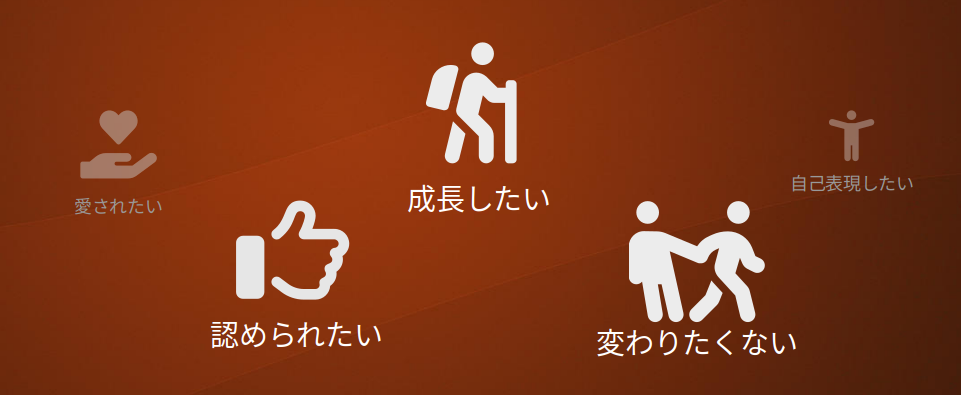

一般には傾聴とは耳を傾けてよく聞くことですが、カウンセリングの分野では傾聴は技法の一つであり、  
古宮は**話し手が表現していること、伝えたいことや気持ちを、できるだけ話し手の身になって想像して理解し、理解したことを相手に言葉で返すこと**[^1]
だとしています。

[^1]: 古宮昇, "傾聴の基本"(総合法令出版, 2020年)

それでは、ここでいう「表現していること」「伝えたいこと」とは何でしょうか。
例えば話し手であるAさんが「仕事でBさんがなかなか協力してくれないんですよ。」という悩みを伝えてきた場合、表面的にはAさんがBさんの問題点を説明しているわけですが、それに対して
「じゃあ上司に言ってBさんの態度を直してもらいましょうか」のような提案をしても、本当の意味では解決になりません。
BさんにはBさんの理由や考えがあるかもしれません。上司から頭ごなしに「Aさんに対する態度を直してよ」などと言われたらBさんの気持ちや態度は一層硬化し問題は悪化するでしょう。
では話し手Aさんの問題点を聞き出して指摘したらどうでしょうか。Aさんにしてみたら「私を助けてほしかったのに、なんで怒られなきゃいけないの？!」と思うでしょう。 
これは話し手が本当に言いたいことではなく、言いやすいことや言う準備ができていることをしゃべっているからです。
本当に言いたいことというのは実際、なかなか表面に現れてこないものです。それを最終的に突き詰めると「心の原動力」につながってきます。

## 心の原動力

私達は**成長したい**という気持ちを心の奥底で強く持っています。  
スポーツやゲームでより強くなり、高い成績を出せるようになることで私達は達成感を感じます。スポーツ観戦やゲーム実況動画に人気があるのは達成感を追体験させてくれるから、という面があるでしょう。
新しい料理を覚えたり、料理がうまくなったりすると嬉しくなります。
一方で新しいことをするときは失敗はつきものです。例えば自転車は最初はだれでもうまく運転できません。
乗り始めたばかりの頃はペダルの漕ぎ方、倒れないようにすること、ハンドルの操作方法など様々なことを同時に考え、何度も倒れながら少しずつ乗り方を分かっていきます。
倒れることで怪我をすることもあるでしょう。ですが、親がその失敗を恐れて「自転車に乗るな」と言ってしまったら子供は成長する機会を失ってしまいます。
傾聴では話し相手の中の「成長したい」という気持ちに気づき、それに良い意味で手出ししないことが求められます。

また私達は**誰かに認められたい**という気持ちを持っています。  
料理を覚え、それを誰かが食べて「美味しかったよ」と言ってもらえると、やりがいを感じ嬉しくなるものです。
子供はみんな親にほめてもらいたいと切実に願っています。
子供が育って大人になった頃には親以外の社会とのつながりが増え、様々な場面で認められることがあるはずですが、子供の頃に認めてもらえなかった気持ちは大人になってもずっと残っています。

組織や社会に役に立つ仕事を見つけることが

一方で私達は**変わりたくたい**とも思っています。
一度成功体験をすると
一度失敗体験をすると、成功体験よりも強烈にそれを避けようと思うようになります。

## 傾聴の技法

## 日常会話の話者として

ここまでで説明してきた傾聴はプロのカウンセラーが時間を決めて有料で行うようなものです。日常会話の中で同じレベルのことをやる必要はありません。
そこで、簡易版の傾聴を考えます

傾聴といえば、相手の言うことに耳を傾けるという
カウンセリング心理学ではアクティブリスニングとよばれる技法となっています。

* 来談者の方を向きアイコンタクト
* 注意を向けつつリラックス
* 相手を遮らない。こちらの意見を言わない
* 内容を理解するための質問
* 相手の感情と同じ感情を表出する

(以下製作中)
