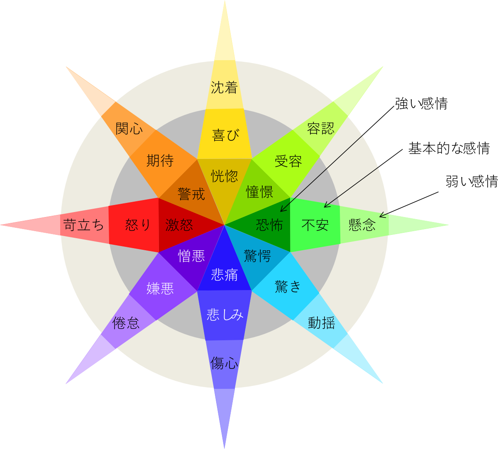

## 感情の分類

心理学における感情の研究を調べてみると、たくさんの研究者によってそれぞれに分類が試みられているのがわかります。
そのいくつかを挙げると、Mowrerは基本的な感情として苦-楽の二つを考えました[^1]。
J. A. Russelは快-不快、熱烈-静穏をそれぞれX-Y軸として、様々な感情を分類しています[^2]。
R. Plutchikは感情を怒り、期待、喜び、受容、不安、驚き、悲しみ、嫌悪の8種類に分け、さらにそれぞれには激怒-怒り-苛立ちのように強弱があること、
激怒-恐怖、憎悪-憧憬のように反対の意味になる感情の対があることを示しています(Fig. 1) [^3]。  

[^1]: O. H. Mowrer, "Learning theory and behavior", New York: Wiley. (1960)
[^2]: J. A. Russell, "A circumplex model of affect", Journal of Personality and Social Psychology, 39, 1161–1178 (1980).
[^3]: R. Plutchik, "Emotion: Theory, research, and experience: Vol. 1. Theories of emotion 1" , New York: Academic (1980)
[^4]: A. Adler, (訳)岸見一郎 "人生の意味の心理学" , アルテ (2010)