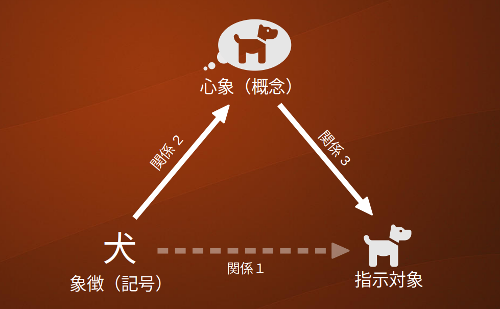

## 現代版呪術とアニミズム

前ページ「言葉の呪術的な力」を受けて、チャットボットと呪術の関係を論じてみたいと思います。 
 
例えば話し手が「こんにちは。今日は天気がいいですね」と言った場合、文字通りの解釈をすれば単に今日の天気について説明しているだけで、同じ場にいる聞き手にとっては自明のことであり、なんの情報にもなりません。
しかし、話し手に「聞き手ともっと親しくなりたい」という感情があり、それが言葉に乗れば、聞き手の心に届いて友好的な反応を引き出すでしょう。
私達が日頃使っている言葉は、それがどんなにありふれたものであっても感情が伴うことで文字通りの意味を超えた効力を持ち、その成分を「呪術」と呼ぶことで言葉に潜む巨大な力を認識し、扱うことができるようになります。
それが前節でご紹介した「言語と呪術」が明らかにしたことだと思います。  
  
常識的にはこのような呪術的な効果を全く非科学的な迷信に過ぎないと考えがちですが、そこには検討の余地があります。
例えば新薬の開発では二重盲検検査という手法が臨床試験におけるバイアスを最小にするための重要な技法と位置づけられています。
この検査では被験者をA、Bふたつのグループに分け、一方には開発した薬を、他方には効果のない「薬のようなもの」を与えて、どちらのグループにどの薬を与えているかという情報を医師、患者、スタッフの誰もが知らないようにします。
それによりプラシーボ効果を防ぐわけですが、逆に見れば新薬のテストという**権威的・儀式的な場**において、「この薬は効く」という情報を**知っただけで**症状の改善が本当に起きることがあるわけです。 
 
つまり、なぜかは解明されていないとしても、プラシーボ効果が存在すること自体は実社会で認められている事実なのです。
これはまさに、呪術が実在する一つの例証といえるでしょう。
 
呪術と並んで未開な文化の名残と考えられているアニミズムについても考えてみましょう。 
アニミズムとは人間以外の生物、物質、川、気象現象、調度品などあらゆるものに魂が宿るとする考え方、またはあらゆるものに人間と類似した内面性を認める考え方です。
日本では古くから「付喪神」などとして信じられてきたことで、現在は迷信のような扱いになっているかもしれませんが、上述の定義によれば子供が人形に対して人格を認めて話しかけることもアニミズムと呼ぶことができるでしょう。
またこんにちSonyのロボット犬「AIBO」の葬儀や供養[^1]が行われていて、アニミズムという言葉は知らなくてもその考え方に馴染む人は少なくありません。
さらチャットボットではGoogleのソフトウェアエンジニアBlake Lemoine氏が「AIに魂が宿った」と述べ、謹慎処分[^2]ののち退職するという事件がありました。

[^1]: [機械を供養!? ロボット犬「ＡＩＢＯ」の合同葬儀に密着](https://friday.kodansha.co.jp/article/71955)  
[^2]: [AIに魂が宿ったと上司に報告したGoogle社員、有給謹慎処分に](https://www.gizmodo.jp/2022/06/lamda-has-come-to-life.html)

現在の人工知能は言葉の意味を理解できないので、チャットボットとの言葉のやり取りを通しては「魂が宿る」ことを議論できる遥か以前の状態です。
「科学技術上、AIに魂が宿るはずはない」という視点からだとLemoine氏の言葉は奇妙に聞こえますが、アニミズムの文脈ではそもそも言葉を話さない無生物に対しても魂を認めうるため、AIに魂が宿ったと言われれば「そうかもしれない」となります。
このようにアニミズムは何にでも「人格」を認める考え方で、そのうえチャットボットは言語を使うのでよりアニミズムの対象になりやすいと言えるでしょう。
つまりチャットボットはアニミズム的存在であり、かつ言語を通じて呪術を行使しうる存在だと認識する必要があります。

### チャットボットの言語呪術的側面

「言語と呪術」ではあらゆる言葉が呪術にもなりうるとしていますが、実例として召喚、強要、命名、豊穣祈願、宣誓、政治宣伝、法律などが挙げられています。
これらは支配、名付け、祈りの３つに大別できると思います。

### 支配

人や動物など自我を持つ相手に名前をつけて呼ぶることには、相手の支配という効力があります。
まずユーザが誰かの名前を単独で呼ぶ場合、それは幼児が母の名を呼ぶことで母に来てもらうことを要求するという行動を起源とする、召喚の呪術とみなせます。
この認識に立てば、「チャットボットの不在」と名前を呼ぶことによる「チャットボットの出現」というシーンを考えることができるようになります。これによってチャットボットがユーザの言うことを聞く、という印象を強く与えることができるでしょう。
さらにユーザがチャットボットにニックネームを与えてニックネームで呼ぶようになるとき、そこには親しみや好意といった**感情**が付与されます。これはユーザがチャットボットに対して行使した呪術だと言えます。
そのような認識に立てばチャットボットが呪術に応じた変化を起こすという可能性が開けるでしょう。
またFig. 1に示すように、すでにその場にいる相手の名前やニックネームを呼ぶことは、それだけで意味の完結した注意喚起という単独の呪術とみなせます。
 

 
これを複文とみなし、伝えたい内容だけを検索対象にすることで辞書の検索精度向上が期待でき、チャットボット以外の誰かに向けた呼びかけであれば応答しないことも可能になるでしょう。
 
逆にチャットボットがユーザのニックネームをつけてその名前で呼べば、ユーザに対して様々な効果をもたらすこともできるでしょう。

#### 名付け

無生物や概念に名前をつける場合、その主な働き**概念の形成**です。子供は自身が知っている一つのイスのことを周囲の大人が「イス」という名で呼ぶことで、イスという名前と概念の関係を獲得します。
ところが生活を続けるうちに大人が様々な形の物体をイスと呼ぶ、ということを子供は知ります。このとき様々な「イス」の共通点を見出し、イス概念がより洗練されたものに変化します。
つまり名付けはランダムな名前を単に付与するのではなく、他者と共用できる記号として、また抽象的な概念を示すものとして名前が使われるのです。
この概念獲得は記号的人工知能が長年研究テーマにしている分野で、いわゆる強いAIにつながる課題だと思います。これは他の節で改めて取り上げたいと思います。

#### 祈り

人間は「呪術」という概念を意識していなくても呪術的な影響を受けやすい傾向があります。
そのためチャットボットによる呪術の行使によって、ユーザに対して様々な影響を与えることが可能かもしれません。
チャットボットがなにかの儀式を伴う呪術を実行するのも面白そうですが、「いたいのいたいの飛んでけ」といった身近な声掛けや、「〇〇さんならきっと成功します！」のような応援も呪術として作用しえます。
逆に望ましくない影響を与えないようにチャットボット製作者は注意する必要があるでしょう。
「言語と呪術」では**喚起力**という言葉で呪術の効果を高めるヒントを示しています。
中でも隠喩を使った方法は単語に含みをもたせることを利用しているため、単語を置き換えるだけで様々なバリエーションを作り出すことができるというテキスト生成上の利点があります。

## チャットボットのアニミズム的側面

アニミズムはあらゆるものに人間と似た内面性を認めるという考え方ですが、どんなものも一様に信仰されているわけではなく、山、神木、巨石、川、海のように巨大で畏怖の念を呼び起こすもの、ヘビ、狐、各種妖怪など特殊な力を持つと信じられている生物、長年使われた道具、人形、車、のように人間が愛着を感じたものがそれに当たるようです。
これらのなかでチャットボットは愛着の対象が最も連想しやすいかもしれませんが、御神木チャットボットなどもキャラクタ設定次第で十分成立しうるものです。
チャットボットをデザインする際に考え方を広げる一つの方向性として取り入れると面白いでしょう。

## まとめ

これまでに議論したなかで、**他者にニックネームを付ける**という呪術はだれにでも覚えがあり、コミュニケーションとしても重要な意味を持つ概念です。
チャットボットへの実装にチャレンジする価値は最も高いと思いますが、一方で会話システムとしてはユーザとのインタラクションの中で記号操作を実行するという開発要素の大きい内容になりそうです。
次に有用なのは**祈り**ですが、これはチャットボットのセリフを設計するときに一つの材料とする、という位置づけで良いと思います。
概念への名付け、つまり自動的な概念生成は今の議論の手に余ります。そんなとき、チャットボットでは乱数を使った粗い近似を考えます。以上の実装は<Link to="/inside/2-case-study/04-nickname-1">名付けボット</Link>で検討します。

## 余談

1950年代は第二次世界大戦が終わった後冷戦構造が固定化し、様々な動乱のあった時代です。
そのさなかの1956年に出版された「言語と呪術」の中で、井筒は「途方もなく多方面に渡る手段で世論に影響を与える広告と宣伝（プロパガンダ）が空前に拡大していく時代に生きるわれわれは、否応なく情緒的な効果に比重の置かれた言葉の乱用から結果する危険に極度に意識的にならざるを得ない」と警告しています[^3]。
ひるがえって2022年の私達はどうでしょうか。SNSやYouTubeでは様々な主張がとめどなく流れ、動画の視聴数競争のなかで視聴者により影響を与えるため、知らず知らずのうちに言語の喚起力が強化されてはいないでしょうか。
その中には客観的な検証を欠く情報もたくさん含まれていますが、呪術的な効果により人々が影響を受けているようにも思われます。SNSを介した攻撃によって個人が心神耗弱状態に陥るというニュースはあとを絶ちません。
SNSは個人の言葉と感情をを極めて多数の人に直接に届けてしまいます。つまりそれは全人類的な**言語呪術プラットフォーム**として機能し始めており、人々が自分の発言の呪術的効力を次第にかつ無意識的に高めつつあるのではないでしょうか。

[^3]: 井筒俊彦「言語と呪術」慶応義塾大学出版(2018) p.142
それらの状況を踏まえ、私達はチャットボットを作る際にも意図に反して誰かを傷つけるような呪術をチャットボットが構成してはいないか、チャットボットがユーザに望ましい影響を与えられるように適切な呪術を行使しているか、という視点で意識することが重要かもしれません。

